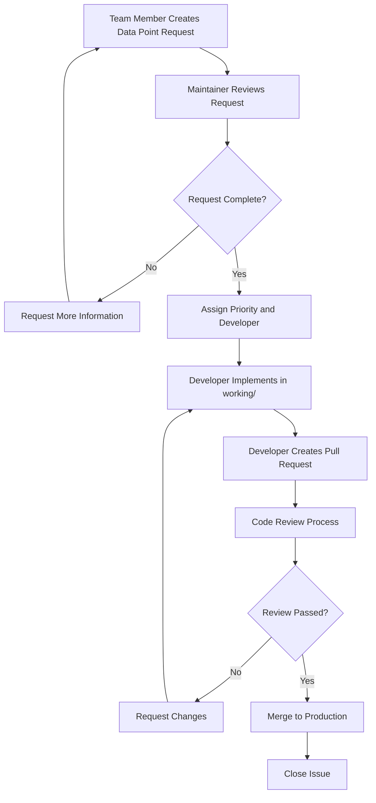
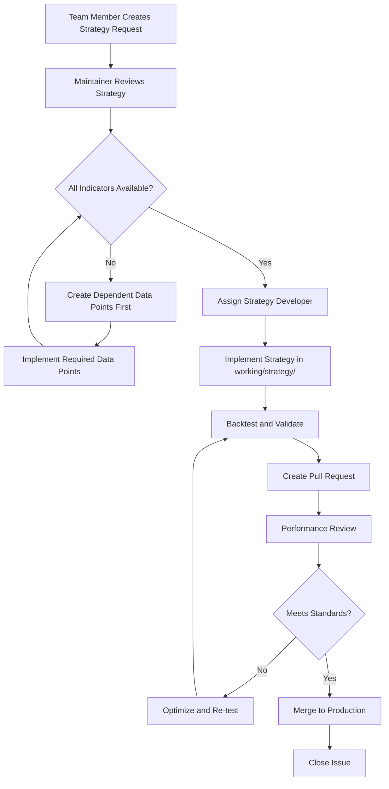

# Complete Implementation Guide
## Pine Script Trading Signals & Strategy Engine

This comprehensive guide walks you through every aspect of implementing, contributing to, and managing this Pine Script trading signals project.

## 📑 Table of Contents

1. [Project Setup & Repository Creation](#project-setup--repository-creation)
2. [Understanding the Architecture](#understanding-the-architecture)
3. [Setting Up Your Development Environment](#setting-up-your-development-environment)
4. [Creating Data Points - Complete Walkthrough](#creating-data-points---complete-walkthrough)
5. [Creating Strategy Models - Complete Walkthrough](#creating-strategy-models---complete-walkthrough)
6. [TTS Integration - Step by Step](#tts-integration---step-by-step)
7. [Testing & Validation Guide](#testing--validation-guide)
8. [Team Management & Workflow](#team-management--workflow)
9. [Advanced Features & Customization](#advanced-features--customization)
10. [Troubleshooting & Common Issues](#troubleshooting--common-issues)

---

## 1. Project Setup & Repository Creation

### Step 1: Create GitHub Repository

1. **Go to GitHub and create a new repository**:
   - Repository name: `pinescript-trading-signals` (or your preferred name)
   - Description: "Pine Script indicators and strategy development platform with intelligent signal composition"
   - Set to Public or Private (your choice)
   - Initialize with README: **NO** (we have our own)

2. **Clone and setup locally**:
   ```bash
   # Navigate to your Pine Script codebase directory
   cd "/Users/tradesdontlie/1. Pinescript CodeBase"
   
   # Initialize git (if not already done)
   git init
   
   # Add remote repository
   git remote add origin https://github.com/yourusername/pinescript-trading-signals.git
   
   # Add all files
   git add .
   
   # Commit initial setup
   git commit -m "Initial project setup with GitHub templates and comprehensive documentation

   - Add data point request template for team contributions
   - Add strategy model template for multi-indicator strategies  
   - Add comprehensive PR template with Pine Script v6 validation
   - Add GitHub Actions workflow for automated validation
   - Add detailed README and CONTRIBUTING guides
   - Implement TTS framework integration standards
   - Setup signal classification system (bias/momentum/execution/confluence)"
   
   # Push to GitHub
   git branch -M main
   git push -u origin main
   ```

### Step 2: Configure Repository Settings

1. **Enable GitHub Features**:
   - Go to repository Settings → Features
   - Enable: Issues, Projects, Wiki, Discussions
   - Enable: Sponsorships (if desired)

2. **Set up Issue Templates**:
   - Go to Settings → Features → Issues → Set up templates
   - Your templates should automatically appear
   - Configure labels: `data-point`, `strategy`, `enhancement`, `bug`, `documentation`

3. **Configure Branch Protection**:
   - Go to Settings → Branches
   - Add rule for `main` branch:
     - ✅ Require a pull request before merging
     - ✅ Require status checks to pass before merging
     - ✅ Require conversation resolution before merging
     - ✅ Include administrators

4. **Set up Project Board**:
   - Go to Projects → Create new project
   - Choose "Board" template
   - Create columns: "Backlog", "To Do", "In Progress", "Review", "Done"

---

## 2. Understanding the Architecture

### Signal Classification System

Our project uses a four-tier signal classification system:

#### 🎯 Bias Filters (Trend/Direction)
- **Purpose**: Determine overall market direction and trend strength
- **Examples**: 
  - FVG trend bias (bullish/bearish gap formations)
  - Moving average slopes and crossovers
  - Market structure breaks (higher highs/lower lows)
- **Signal Range**: -1 (Strong Bearish) to +1 (Strong Bullish)
- **Usage**: Filter trade direction, confirm trend alignment

#### ⚡ Momentum Filters (Strength/Speed)
- **Purpose**: Measure market momentum and acceleration
- **Examples**:
  - Ghost Volume Intelligence momentum
  - RSI momentum divergences
  - Volume-weighted momentum indicators
- **Signal Range**: -1 (Strong Sell Momentum) to +1 (Strong Buy Momentum)
- **Usage**: Time entries, confirm signal strength

#### 🎪 Execution Filters (Entry/Exit Timing)
- **Purpose**: Precise entry and exit timing signals
- **Examples**:
  - Session-based timing filters
  - Cycle-based entry points
  - Confluence confirmation signals
- **Signal Range**: -1 (Strong Exit Signal) to +1 (Strong Entry Signal)
- **Usage**: Execute trades, manage positions

#### 🔄 Confluence Filters (Multi-factor Validation)
- **Purpose**: Combine multiple factors for signal validation
- **Examples**:
  - Multi-timeframe alignment
  - Volume + price action confluence
  - Multiple indicator agreement
- **Signal Range**: 0 (No Confluence) to +1 (Maximum Confluence)
- **Usage**: Validate signal quality, reduce false positives

### TTS Framework Integration

The TTS (Template Trailing Strategy) framework provides standardized signal communication:

```pinescript
// TTS Signal Values
1   = Start Long Deal (Buy/Long Entry)
-1  = Start Short Deal (Sell/Short Entry)
2   = End Long Deal (Close Long Position)
-2  = End Short Deal (Close Short Position)
0   = No Signal (Neutral state)

// Optional advanced signals
3   = Cancel Start Long Deal
-3  = Cancel Start Short Deal
4   = Cancel End Long Deal  
-4  = Cancel End Short Deal
```

---

## 3. Setting Up Your Development Environment

### Required Software

1. **TradingView Account**: Pro or Premium recommended for advanced features
2. **VS Code** (recommended): With Pine Script extension
3. **Git**: For version control
4. **GitHub Account**: For collaboration

### VS Code Setup

1. **Install Pine Script Extension**:
   - Open VS Code
   - Go to Extensions (Ctrl+Shift+X)
   - Search "Pine Script" 
   - Install the official Pine Script extension

2. **Configure Settings**:
   ```json
   // In VS Code settings.json
   {
     "pine.suggest.basic": true,
     "pine.suggest.local": true,
     "pine.autocomplete": true,
     "pine.lint.enabled": true
   }
   ```

3. **Set up File Associations**:
   ```json
   {
     "files.associations": {
       "*.pine": "pine"
     }
   }
   ```

### Local Development Structure

```
Your Project/
├── .github/                      # GitHub templates (created)
├── working/                      # YOUR DEVELOPMENT WORKSPACE
│   ├── fvg/                     # FVG development
│   ├── ghost/                   # Ghost development  
│   ├── oracle/                  # Oracle development
│   ├── sessions/                # Sessions development
│   ├── vortex/                  # Vortex development
│   ├── strategy/                # Strategy development
│   └── testing/                 # Experimental features
├── indicators/                  # Production indicators
├── cursor-memory-bank/          # Documentation and tools
└── README.md                    # Project overview
```

---

## 4. Creating Data Points - Complete Walkthrough

### Example: Adding FVG Bias Filter Data Point

Let's walk through creating a complete data point from start to finish.

#### Step 1: Create Data Point Request Issue

1. **Go to your GitHub repository**
2. **Click "Issues" → "New Issue"**
3. **Select "Data Point Request" template**
4. **Fill out the template**:

```markdown
## 📊 Data Point Request

### Indicator Information
**Indicator Name:** Fair Value Gap (FVG)
**Indicator Category:** FVG
**Indicator File Path:** `indicators/fvg/fvg.pine`

### Data Point Details

#### Signal Identification
**Data Point Name:** FVG Trend Bias Filter
**Signal Type:** 
- [x] Bias Filter (Trend/Direction based)
- [ ] Momentum Filter (Strength/Speed based) 
- [ ] Execution Filter (Entry/Exit timing)
- [ ] Confluence Filter (Multi-factor validation)

#### Signal Logic
**Description:** 
Detects Fair Value Gap formations and determines trend bias based on gap type, size, and volume confirmation. Provides directional bias for filtering trade direction.

**Trigger Conditions:**
- **Long Entry:** Bullish FVG detected with volume > 1.5x average, gap size > minimum threshold
- **Short Entry:** Bearish FVG detected with volume > 1.5x average, gap size > minimum threshold
- **Exit Conditions:** FVG filled or trend momentum weakens

**Signal Values:**
- **Long Signal:** `1` (Start Long Deal)
- **Short Signal:** `-1` (Start Short Deal)
- **Exit Signal:** `0` (No Signal)
- **Neutral:** `0` (No Signal)

### Technical Specifications

#### Input Parameters
```
Parameter Name     | Type  | Default | Description
-------------------|-------|---------|-------------
enable_fvg_bias   | bool  | true    | Enable FVG bias filter
min_fvg_size      | float | 10.0    | Minimum FVG size in pips
volume_multiplier | float | 1.5     | Volume confirmation multiplier
trend_filter      | bool  | true    | Require trend alignment
```

#### Dependencies
**Required Variables/Functions:**
- [x] Variable 1: `bullish_fvg_detected` - Boolean for bullish FVG detection
- [x] Variable 2: `bearish_fvg_detected` - Boolean for bearish FVG detection
- [x] Variable 3: `fvg_size` - Current FVG size in points
- [x] Function 1: `volume_confirmation()` - Volume validation function

**External Dependencies:**
- [ ] Libraries: None
- [ ] Imports: None
```

#### Step 2: Wait for Approval and Assignment

The project maintainer (you) will:
1. Review the request
2. Assign it to a team member
3. Add appropriate labels
4. Provide any additional requirements

#### Step 3: Implement the Data Point

**Create development branch**:
```bash
git checkout -b feature/fvg-bias-filter
cd working/fvg/
```

**Copy existing FVG indicator**:
```bash
cp ../../indicators/fvg/fvg.pine ./fvg_with_bias.pine
```

**Add TTS signal implementation**:

```pinescript
//@version=6
indicator("FVG with Bias Filter", overlay=true)

// ==================== EXISTING FVG LOGIC ====================
// [Your existing FVG detection code here]

// Example variables that should exist in your FVG indicator:
// bullish_fvg_detected = [your bullish FVG logic]
// bearish_fvg_detected = [your bearish FVG logic]  
// fvg_size = [your FVG size calculation]

// ==================== TTS BIAS FILTER IMPLEMENTATION ====================

// Configuration inputs
bias_group = "📊 FVG Bias Filter"
enable_fvg_bias = input.bool(true, "Enable FVG Bias Filter", group=bias_group)
min_fvg_size = input.float(10.0, "Minimum FVG Size (pips)", minval=1.0, group=bias_group)
volume_multiplier = input.float(1.5, "Volume Confirmation Multiplier", minval=1.0, maxval=3.0, step=0.1, group=bias_group)
require_trend_alignment = input.bool(true, "Require Trend Alignment", group=bias_group)

// Volume confirmation
volume_avg = ta.sma(volume, 20)
volume_confirmed = volume > volume_avg * volume_multiplier

// Trend alignment (optional)
trend_ema = ta.ema(close, 50)
trend_bullish = close > trend_ema
trend_bearish = close < trend_ema
trend_aligned_long = require_trend_alignment ? trend_bullish : true
trend_aligned_short = require_trend_alignment ? trend_bearish : true

// Size filter
size_sufficient = fvg_size >= min_fvg_size

// Bias filter conditions
fvg_long_bias = bullish_fvg_detected and volume_confirmed and size_sufficient and trend_aligned_long
fvg_short_bias = bearish_fvg_detected and volume_confirmed and size_sufficient and trend_aligned_short
fvg_neutral = not fvg_long_bias and not fvg_short_bias

// TTS Signal state management
var int bias_signal_state = 0  // 0=neutral, 1=bullish, -1=bearish
var int bars_since_bias_signal = 0

// Generate bias signals
bias_signal_value = 0
bars_since_bias_signal += 1

if enable_fvg_bias and bars_since_bias_signal >= 3  // 3-bar cooldown
    if fvg_long_bias and bias_signal_state != 1
        bias_signal_value := 1
        bias_signal_state := 1
        bars_since_bias_signal := 0
    else if fvg_short_bias and bias_signal_state != -1
        bias_signal_value := -1
        bias_signal_state := -1
        bars_since_bias_signal := 0
    else if fvg_neutral and bias_signal_state != 0
        bias_signal_value := 0
        bias_signal_state := 0
        bars_since_bias_signal := 0

// TTS Output for bias filter
plot(enable_fvg_bias ? bias_signal_value : na, "FVG Bias Signal", color=color.blue, display=display.data_window)

// Visual feedback
bgcolor(fvg_long_bias ? color.new(color.green, 95) : fvg_short_bias ? color.new(color.red, 95) : na, title="FVG Bias Background")

// Bias strength indicator (optional)
bias_strength = fvg_long_bias ? 1 : fvg_short_bias ? -1 : 0
plot(bias_strength, "Bias Strength", color=color.purple, display=display.data_window)

// Alerts
if bias_signal_value == 1 and barstate.isconfirmed
    alert("FVG Bullish Bias Activated", alert.freq_once_per_bar)
if bias_signal_value == -1 and barstate.isconfirmed  
    alert("FVG Bearish Bias Activated", alert.freq_once_per_bar)
if bias_signal_value == 0 and bias_signal_state[1] != 0 and barstate.isconfirmed
    alert("FVG Bias Neutralized", alert.freq_once_per_bar)
```

#### Step 4: Test the Implementation

**Manual Testing Checklist**:
1. **Compilation Test**:
   - Copy code to TradingView Pine Editor
   - Ensure no compilation errors
   - Check for warnings

2. **Functionality Test**:
   - Add to chart and verify signals appear
   - Test on multiple timeframes (1m, 5m, 15m, 1h, 4h)
   - Test on different symbols (EURUSD, BTCUSD, SPY)

3. **Signal Quality Test**:
   - Verify signals make logical sense
   - Check for signal spam (too frequent)
   - Verify no repainting issues

4. **TTS Integration Test**:
   - Verify plot shows in Data Window
   - Check signal values are correct (1, -1, 0)
   - Test with Strategy Template if available

#### Step 5: Document and Submit

**Update documentation**:
```bash
# Add to version history
echo "## FVG Bias Filter v1.0.0
- Added TTS-compatible bias filter
- Configurable FVG size and volume thresholds  
- Optional trend alignment filter
- Proper signal state management
- Alert system integration" >> working/fvg/VERSION_HISTORY.md
```

**Commit and push**:
```bash
git add .
git commit -m "Add FVG bias filter data point

- Implement TTS-compatible bias signal
- Add volume and size confirmation filters
- Include optional trend alignment
- Proper signal state management prevents duplicates
- Alert system for signal changes
- Tested on multiple timeframes and symbols"

git push origin feature/fvg-bias-filter
```

**Create Pull Request**:
1. Go to GitHub repository
2. Click "Compare & pull request"
3. Fill out the PR template thoroughly
4. Request review from maintainer

---

## 5. Creating Strategy Models - Complete Walkthrough

### Example: Multi-Indicator Composite Strategy

Let's create a strategy that combines FVG, Ghost, and Oracle signals with weighted scoring.

#### Step 1: Create Strategy Model Issue

Use the Strategy Model template to define:
- Required indicators and their data points
- Weighted scoring configuration
- Entry/exit thresholds
- Risk management parameters

#### Step 2: Implement Strategy Logic

**Create strategy file**:
```bash
cd working/strategy/
touch Multi_Indicator_Composite_Strategy.pine
```

**Implement weighted scoring strategy**:
```pinescript
//@version=6
strategy("Multi-Indicator Composite Strategy", overlay=true, default_qty_type=strategy.percent_of_equity, default_qty_value=10)

// ==================== STRATEGY CONFIGURATION ====================
strategy_group = "🎯 Strategy Configuration"
enable_strategy = input.bool(true, "Enable Strategy", group=strategy_group)
enable_long_trades = input.bool(true, "Enable Long Trades", group=strategy_group)
enable_short_trades = input.bool(true, "Enable Short Trades", group=strategy_group)

// ==================== DATA POINT WEIGHTS ====================
weights_group = "⚖️ Signal Weights"
fvg_weight = input.float(0.4, "FVG Weight", minval=0, maxval=1, step=0.1, group=weights_group)
ghost_weight = input.float(0.3, "Ghost Weight", minval=0, maxval=1, step=0.1, group=weights_group)
oracle_weight = input.float(0.3, "Oracle Weight", minval=0, maxval=1, step=0.1, group=weights_group)

// Normalize weights
total_weight = fvg_weight + ghost_weight + oracle_weight
nw_fvg = total_weight > 0 ? fvg_weight / total_weight : 0
nw_ghost = total_weight > 0 ? ghost_weight / total_weight : 0
nw_oracle = total_weight > 0 ? oracle_weight / total_weight : 0

// ==================== THRESHOLDS ====================
thresholds_group = "🎚️ Signal Thresholds"
entry_threshold = input.float(0.7, "Entry Threshold", minval=0, maxval=1, step=0.1, group=thresholds_group)
exit_threshold = input.float(0.3, "Exit Threshold", minval=0, maxval=1, step=0.1, group=thresholds_group)
confluence_requirement = input.int(2, "Minimum Signal Confluence", minval=1, maxval=3, group=thresholds_group)

// ==================== DATA POINT INPUTS ====================
// Note: In practice, these would come from your actual indicators
// For this example, we'll simulate the signals

signals_group = "📡 Signal Inputs"
simulate_signals = input.bool(true, "Simulate Signals (for testing)", group=signals_group)

// Simulated signal functions (replace with actual indicator data)
get_fvg_signal() =>
    if simulate_signals
        // Simple RSI-based simulation for FVG bias
        rsi_val = ta.rsi(close, 14)
        rsi_val > 70 ? -0.8 : rsi_val < 30 ? 0.8 : 0.0
    else
        // Replace with actual FVG bias signal
        0.0

get_ghost_signal() =>
    if simulate_signals
        // Simple volume-based simulation for Ghost momentum
        vol_sma = ta.sma(volume, 20)
        vol_ratio = volume / vol_sma
        close > open and vol_ratio > 1.5 ? 0.7 : close < open and vol_ratio > 1.5 ? -0.7 : 0.0
    else
        // Replace with actual Ghost momentum signal
        0.0

get_oracle_signal() =>
    if simulate_signals
        // Simple EMA crossover simulation for Oracle execution
        ema_fast = ta.ema(close, 12)
        ema_slow = ta.ema(close, 26)
        cross_up = ta.crossover(ema_fast, ema_slow)
        cross_down = ta.crossunder(ema_fast, ema_slow)
        cross_up ? 0.9 : cross_down ? -0.9 : 0.0
    else
        // Replace with actual Oracle execution signal
        0.0

// ==================== SIGNAL PROCESSING ====================

// Get individual signal scores (-1 to 1)
fvg_score = get_fvg_signal()
ghost_score = get_ghost_signal()
oracle_score = get_oracle_signal()

// Calculate weighted composite score
composite_score = (fvg_score * nw_fvg) + (ghost_score * nw_ghost) + (oracle_score * nw_oracle)

// Count signal confluence (how many signals agree)
signals_bullish = (fvg_score > 0 ? 1 : 0) + (ghost_score > 0 ? 1 : 0) + (oracle_score > 0 ? 1 : 0)
signals_bearish = (fvg_score < 0 ? 1 : 0) + (ghost_score < 0 ? 1 : 0) + (oracle_score < 0 ? 1 : 0)
max_confluence = math.max(signals_bullish, signals_bearish)

// ==================== ENTRY/EXIT LOGIC ====================

// Entry conditions
long_entry_condition = enable_long_trades and composite_score >= entry_threshold and signals_bullish >= confluence_requirement
short_entry_condition = enable_short_trades and composite_score <= -entry_threshold and signals_bearish >= confluence_requirement

// Exit conditions
long_exit_condition = composite_score <= exit_threshold or signals_bullish < confluence_requirement
short_exit_condition = composite_score >= -exit_threshold or signals_bearish < confluence_requirement

// ==================== STRATEGY EXECUTION ====================

if enable_strategy
    // Long trades
    if long_entry_condition and strategy.position_size == 0
        strategy.entry("Long", strategy.long, comment="Multi-Signal Long")
    
    if strategy.position_size > 0 and long_exit_condition
        strategy.close("Long", comment="Multi-Signal Long Exit")
    
    // Short trades  
    if short_entry_condition and strategy.position_size == 0
        strategy.entry("Short", strategy.short, comment="Multi-Signal Short")
    
    if strategy.position_size < 0 and short_exit_condition
        strategy.close("Short", comment="Multi-Signal Short Exit")

// ==================== TTS SIGNAL OUTPUT ====================

// Generate TTS-compatible signals for external strategy templates
var int position_state = 0  // 0=no position, 1=long, -1=short
tts_signal_value = 0

if long_entry_condition and position_state == 0
    tts_signal_value := 1
    position_state := 1
else if short_entry_condition and position_state == 0
    tts_signal_value := -1  
    position_state := -1
else if position_state == 1 and long_exit_condition
    tts_signal_value := 2
    position_state := 0
else if position_state == -1 and short_exit_condition
    tts_signal_value := -2
    position_state := 0

// TTS output plot
plot(tts_signal_value, "Strategy Signal", color=color.orange, display=display.data_window)

// ==================== VISUALIZATION ====================

// Background coloring based on composite score
bgcolor(composite_score >= entry_threshold ? color.new(color.green, 90) : 
        composite_score <= -entry_threshold ? color.new(color.red, 90) : na)

// Plot individual signals for debugging
plot(fvg_score, "FVG Score", color=color.blue, display=display.data_window)
plot(ghost_score, "Ghost Score", color=color.purple, display=display.data_window)  
plot(oracle_score, "Oracle Score", color=color.yellow, display=display.data_window)
plot(composite_score, "Composite Score", color=color.white, linewidth=2, display=display.data_window)

// Plot thresholds
hline(entry_threshold, "Entry Threshold", color=color.green, linestyle=hline.style_dashed)
hline(-entry_threshold, "Entry Threshold", color=color.red, linestyle=hline.style_dashed)
hline(exit_threshold, "Exit Threshold", color=color.gray, linestyle=hline.style_dotted)
hline(-exit_threshold, "Exit Threshold", color=color.gray, linestyle=hline.style_dotted)

// ==================== ALERTS ====================

// Strategy alerts
if long_entry_condition and barstate.isconfirmed
    alert("Multi-Signal LONG ENTRY: " + syminfo.ticker + " at " + str.tostring(close), alert.freq_once_per_bar)

if short_entry_condition and barstate.isconfirmed
    alert("Multi-Signal SHORT ENTRY: " + syminfo.ticker + " at " + str.tostring(close), alert.freq_once_per_bar)

if (long_exit_condition and strategy.position_size > 0) and barstate.isconfirmed
    alert("Multi-Signal LONG EXIT: " + syminfo.ticker + " at " + str.tostring(close), alert.freq_once_per_bar)

if (short_exit_condition and strategy.position_size < 0) and barstate.isconfirmed
    alert("Multi-Signal SHORT EXIT: " + syminfo.ticker + " at " + str.tostring(close), alert.freq_once_per_bar)

// ==================== PERFORMANCE METRICS ====================

// Table for real-time performance display (optional)
if barstate.islast
    var table performance_table = table.new(position.top_right, 3, 8, bgcolor=color.white, border_width=1)
    
    table.cell(performance_table, 0, 0, "Metric", text_color=color.black, bgcolor=color.gray)
    table.cell(performance_table, 1, 0, "Value", text_color=color.black, bgcolor=color.gray)
    table.cell(performance_table, 2, 0, "Status", text_color=color.black, bgcolor=color.gray)
    
    table.cell(performance_table, 0, 1, "Composite Score", text_color=color.black)
    table.cell(performance_table, 1, 1, str.tostring(composite_score, "#.##"), text_color=color.black)
    score_status = composite_score >= entry_threshold ? "LONG" : composite_score <= -entry_threshold ? "SHORT" : "NEUTRAL"
    table.cell(performance_table, 2, 1, score_status, text_color=color.black)
    
    table.cell(performance_table, 0, 2, "Confluence", text_color=color.black)
    table.cell(performance_table, 1, 2, str.tostring(max_confluence), text_color=color.black)
    conf_status = max_confluence >= confluence_requirement ? "✓" : "✗"
    table.cell(performance_table, 2, 2, conf_status, text_color=color.black)
    
    table.cell(performance_table, 0, 3, "Position", text_color=color.black)
    pos_size = strategy.position_size
    pos_text = pos_size > 0 ? "LONG" : pos_size < 0 ? "SHORT" : "FLAT"
    table.cell(performance_table, 1, 3, pos_text, text_color=color.black)
    
    table.cell(performance_table, 0, 4, "P&L", text_color=color.black)
    pnl_text = str.tostring(strategy.netprofit, "#.##")
    table.cell(performance_table, 1, 4, pnl_text, text_color=strategy.netprofit >= 0 ? color.green : color.red)
```

#### Step 3: Test Strategy Performance

**Backtesting Checklist**:
1. **Multiple Timeframes**: Test on 1m, 5m, 15m, 1h, 4h, daily
2. **Multiple Symbols**: Test on forex, crypto, stocks, indices
3. **Different Market Conditions**: Trending vs ranging markets
4. **Performance Metrics**: Win rate, profit factor, max drawdown, Sharpe ratio

**Performance Targets**:
- Win Rate: > 60%
- Profit Factor: > 1.5
- Maximum Drawdown: < 20%
- Sharpe Ratio: > 1.0

---

## 6. TTS Integration - Step by Step

### Understanding TTS Framework

The TTS (Template Trailing Strategy) framework enables your indicators to communicate with automated trading strategies through standardized signals.

#### TTS Signal Convention

```pinescript
// Entry Signals
1   = Start Long Deal (Buy/Long Entry)
-1  = Start Short Deal (Sell/Short Entry)

// Exit Signals  
2   = End Long Deal (Close Long Position)
-2  = End Short Deal (Close Short Position)

// Neutral/Cancel Signals
0   = No Signal (Neutral state)
3   = Cancel Start Long Deal (Cancel pending long entry)
-3  = Cancel Start Short Deal (Cancel pending short entry)
4   = Cancel End Long Deal (Cancel pending long exit)
-4  = Cancel End Short Deal (Cancel pending short exit)
```

### Step-by-Step TTS Implementation

#### Step 1: Basic TTS Template

Add this template to any indicator to make it TTS-compatible:

```pinescript
// ===== TTS SIGNAL TEMPLATE START =====

// TTS Configuration
tts_group = "📡 TTS Signals"
enable_tts = input.bool(true, "Enable TTS Signals", group=tts_group)
signal_sensitivity = input.float(1.0, "Signal Sensitivity", minval=0.1, maxval=2.0, step=0.1, group=tts_group)

// Replace these conditions with your indicator's logic
your_long_condition = false   // ⬅️ REPLACE WITH YOUR BULLISH CONDITION
your_short_condition = false  // ⬅️ REPLACE WITH YOUR BEARISH CONDITION  
your_exit_condition = false   // ⬅️ REPLACE WITH YOUR EXIT CONDITION

// Signal state management (prevents duplicate signals)
var int signal_state = 0  // 0=no position, 1=long, -1=short
var int bars_since_signal = 0

// Generate signals with cooldown
signal_value = 0
bars_since_signal += 1

if enable_tts and bars_since_signal >= 3  // 3-bar cooldown prevents spam
    
    if your_long_condition and signal_state == 0
        signal_value := 1      // Long entry
        signal_state := 1
        bars_since_signal := 0
        
    else if your_short_condition and signal_state == 0  
        signal_value := -1     // Short entry
        signal_state := -1
        bars_since_signal := 0
        
    else if your_exit_condition and signal_state != 0
        signal_value := signal_state > 0 ? 2 : -2  // Exit signal
        signal_state := 0
        bars_since_signal := 0

// Apply sensitivity multiplier
adjusted_signal = signal_value * signal_sensitivity

// Output signal for strategy template (CRITICAL: exact title required)
plot(enable_tts ? adjusted_signal : na, "TTS Signal", display=display.data_window)

// Visual confirmation on your indicator
plotshape(signal_value == 1, "TTS Long", shape.triangleup, 
          location.belowbar, color.lime, size=size.small, text="L")
plotshape(signal_value == -1, "TTS Short", shape.triangledown, 
          location.abovebar, color.red, size=size.small, text="S")
plotshape(math.abs(signal_value) == 2, "TTS Exit", 
          shape.xcross, location.absolute, color.orange, size=size.small, text="X")

// Optional: Alert when signals trigger
if signal_value != 0 and barstate.isconfirmed
    signal_text = signal_value == 1 ? "LONG ENTRY" : signal_value == -1 ? "SHORT ENTRY" : 
                  signal_value == 2 ? "LONG EXIT" : signal_value == -2 ? "SHORT EXIT" : "SIGNAL"
    alert("TTS " + signal_text + " on " + syminfo.ticker, alert.freq_once_per_bar)

// ===== TTS SIGNAL TEMPLATE END =====
```

#### Step 2: Customize for Your Indicator

Replace the placeholder conditions with your actual indicator logic:

**Example for FVG Indicator**:
```pinescript
// FVG-specific conditions
min_fvg_size = input.float(10.0, "Minimum FVG Size (pips)", group=tts_group)
require_volume = input.bool(true, "Require Volume Confirmation", group=tts_group)

// Volume confirmation
volume_ok = require_volume ? volume > ta.sma(volume, 20) * 1.5 : true

// Size filter
size_ok = fvg_size >= min_fvg_size

// Replace template conditions with FVG logic
your_long_condition := bullish_fvg_detected and volume_ok and size_ok
your_short_condition := bearish_fvg_detected and volume_ok and size_ok
your_exit_condition := fvg_filled
```

**Example for RSI Indicator**:
```pinescript
// RSI-specific conditions
rsi_oversold = input.int(30, "RSI Oversold Level", minval=1, maxval=50, group=tts_group)
rsi_overbought = input.int(70, "RSI Overbought Level", minval=50, maxval=99, group=tts_group)

rsi_value = ta.rsi(close, 14)

// Replace template conditions with RSI logic
your_long_condition := ta.crossover(rsi_value, rsi_oversold)
your_short_condition := ta.crossunder(rsi_value, rsi_overbought)
your_exit_condition := (signal_state == 1 and rsi_value >= rsi_overbought) or 
                      (signal_state == -1 and rsi_value <= rsi_oversold)
```

#### Step 3: Advanced TTS Features

**Multi-Condition Signals**:
```pinescript
// Combine multiple factors for stronger signals
confluence_score = 0

// Add points for each confirming factor
if primary_indicator_bullish
    confluence_score += 2
if volume_confirmation  
    confluence_score += 1
if trend_alignment
    confluence_score += 1
if time_filter_ok
    confluence_score += 1

// Only signal when multiple factors align
min_confluence = input.int(3, "Minimum Confluence Score", group=tts_group)

your_long_condition := confluence_score >= min_confluence and primary_indicator_bullish
your_short_condition := confluence_score >= min_confluence and primary_indicator_bearish
```

**Time-Based Filters**:
```pinescript
// Only trade during specific hours
trading_hours = input.session("0930-1600", "Trading Hours", group=tts_group)
time_ok = not na(time(timeframe.period, trading_hours))

your_long_condition := [your_original_long_condition] and time_ok
your_short_condition := [your_original_short_condition] and time_ok
```

**Risk-Based Exits**:
```pinescript
// Exit based on risk metrics
current_atr = ta.atr(14)
risk_threshold = input.float(2.0, "Risk Threshold (ATR)", group=tts_group)

high_risk = current_atr > ta.sma(ta.atr(14), 50) * risk_threshold

your_exit_condition := [your_original_exit_condition] or high_risk
```

#### Step 4: Testing TTS Integration

**Integration Test Checklist**:

1. **Plot Visibility**:
   ```pinescript
   // Verify signal appears in Data Window
   // Check exact plot title: "TTS Signal"
   ```

2. **Signal Values**:
   ```pinescript
   // Verify values are exactly: 1, -1, 2, -2, 0
   // No decimal values or other numbers
   ```

3. **State Management**:
   ```pinescript
   // Verify no duplicate signals
   // Check proper entry/exit sequence
   // Test cooldown period working
   ```

4. **Strategy Template Connection**:
   - Add both indicator and strategy template to same chart
   - Set strategy to "🔨External" mode
   - Select your indicator's "TTS Signal" as source
   - Verify trades execute correctly

#### Step 5: TTS Debugging

**Common Issues and Solutions**:

```pinescript
// ❌ Issue: Strategy doesn't see signals
// ✅ Solution: Check exact plot title
plot(signal_value, "TTS Signal", display=display.data_window)  // Exact title required

// ❌ Issue: Too many signals
// ✅ Solution: Implement proper cooldown
if enable_tts and bars_since_signal >= 3  // Increase cooldown period

// ❌ Issue: Signals repainting
// ✅ Solution: Use confirmed bar data
if your_condition and barstate.isconfirmed  // Only use confirmed bars

// ❌ Issue: Wrong signal sequence
// ✅ Solution: Proper state management
if your_long_condition and signal_state == 0  // Check current state
    signal_value := 1
    signal_state := 1  // Update state
```

**Debug Plots**:
```pinescript
// Add these for debugging (remove for production)
plot(signal_state, "Debug State", color=color.blue, display=display.data_window)
plot(bars_since_signal, "Debug Cooldown", color=color.yellow, display=display.data_window)
plot(your_long_condition ? 1 : 0, "Debug Long Condition", color=color.green, display=display.data_window)
plot(your_short_condition ? 1 : 0, "Debug Short Condition", color=color.red, display=display.data_window)
```

---

## 7. Testing & Validation Guide

### Comprehensive Testing Framework

#### Level 1: Unit Testing (Individual Components)

**Pine Script Compilation Test**:
```bash
# Test compilation in TradingView
1. Copy code to Pine Editor
2. Save and compile
3. Check for errors/warnings
4. Verify all inputs work correctly
```

**Signal Logic Test**:
```pinescript
// Add debug plots to verify logic
plot(your_long_condition ? 1 : 0, "Long Condition Debug", color=color.green)
plot(your_short_condition ? 1 : 0, "Short Condition Debug", color=color.red)
plot(your_exit_condition ? 1 : 0, "Exit Condition Debug", color=color.orange)
```

**State Management Test**:
```pinescript
// Verify state transitions
plot(signal_state, "Signal State", color=color.blue)
plot(bars_since_signal, "Bars Since Signal", color=color.yellow)
```

#### Level 2: Integration Testing (Component Interaction)

**TTS Framework Test**:
1. Add indicator to chart
2. Verify "TTS Signal" appears in Data Window
3. Check signal values are correct integers
4. Test with Strategy Template

**Multi-Timeframe Test**:
```bash
Test Timeframes:
- 1 minute (high frequency)
- 5 minutes (scalping)
- 15 minutes (day trading)
- 1 hour (swing trading)
- 4 hours (position trading)
- Daily (long-term)
```

**Multi-Symbol Test**:
```bash
Forex: EURUSD, GBPUSD, USDJPY
Crypto: BTCUSD, ETHUSD, ADAUSD
Stocks: SPY, AAPL, MSFT, TSLA
Indices: SPX500, NAS100, UK100
```

#### Level 3: Performance Testing

**Signal Quality Metrics**:
```pinescript
// Track signal performance
var int total_signals = 0
var int correct_signals = 0
var float total_pnl = 0.0

// Update on signal generation
if signal_value != 0
    total_signals += 1
    
// Update on trade completion
if strategy.closedtrades.exit_price(strategy.closedtrades - 1) != na
    trade_pnl = strategy.closedtrades.profit(strategy.closedtrades - 1)
    total_pnl += trade_pnl
    if trade_pnl > 0
        correct_signals += 1

// Calculate metrics
win_rate = total_signals > 0 ? correct_signals / total_signals * 100 : 0
avg_pnl = total_signals > 0 ? total_pnl / total_signals : 0
```

**Performance Benchmarks**:
- **Win Rate**: Target > 60%
- **Profit Factor**: Target > 1.5
- **Maximum Drawdown**: Target < 20%
- **Average Trade**: Positive expected value
- **Signal Frequency**: 1-10 signals per day (optimal)

#### Level 4: Stress Testing

**High Volatility Test**:
```bash
Test during high volatility periods:
- Market open/close
- News events
- Earnings announcements
- Economic data releases
```

**Edge Case Testing**:
```pinescript
// Test extreme market conditions
- Gap ups/downs
- Low volume periods  
- Trending markets
- Ranging/sideways markets
- High frequency trading periods
```

### Automated Testing Setup

**GitHub Actions Integration**:
The project includes automated testing via GitHub Actions. The workflow:

1. **Syntax Validation**: Checks Pine Script v6 compliance
2. **TTS Integration**: Verifies proper signal implementation
3. **Performance Check**: Validates calculation efficiency
4. **Documentation**: Ensures proper documentation

**Local Testing Script**:
```bash
#!/bin/bash
# File: test_indicator.sh

echo "🧪 Running Pine Script Tests..."

# Test 1: File structure
echo "📁 Checking file structure..."
if [ ! -f "working/$1" ]; then
    echo "❌ File not found: working/$1"
    exit 1
fi

# Test 2: Pine Script v6 compliance  
echo "📜 Checking Pine Script v6 compliance..."
if ! grep -q "//@version=6" "working/$1"; then
    echo "❌ Missing //@version=6 declaration"
    exit 1
fi

# Test 3: TTS integration
echo "📡 Checking TTS integration..."
if ! grep -q "TTS Signal" "working/$1"; then
    echo "⚠️  TTS Signal plot not found"
fi

# Test 4: Single line functions
echo "🔍 Checking for multi-line function calls..."
# This is a simplified check - the GitHub Actions does more thorough validation

echo "✅ All tests passed!"
```

**Usage**:
```bash
chmod +x test_indicator.sh
./test_indicator.sh fvg/fvg_with_bias.pine
```

### Manual Testing Procedures

#### Functional Testing Checklist

**📋 Basic Functionality**:
- [ ] Indicator compiles without errors
- [ ] All input parameters work correctly
- [ ] Visual elements display as expected
- [ ] Alerts function properly (if implemented)

**📋 Signal Generation**:
- [ ] Signals generate at correct conditions
- [ ] No signal spam (excessive frequency)
- [ ] Proper signal sequencing (entry → exit)
- [ ] Cooldown periods working

**📋 TTS Integration**:
- [ ] "TTS Signal" appears in Data Window
- [ ] Signal values are correct integers (1, -1, 2, -2, 0)
- [ ] No decimal or invalid values
- [ ] Strategy Template can read signals

**📋 Performance**:
- [ ] Calculation time under 500ms per bar
- [ ] No memory leaks or excessive resource usage
- [ ] Works smoothly on all timeframes
- [ ] No browser freezing or lag

#### Quality Assurance Testing

**📋 Signal Quality**:
- [ ] Signals make logical trading sense
- [ ] No obvious false signals
- [ ] Proper risk/reward potential
- [ ] Signals align with market conditions

**📋 Robustness**:
- [ ] Works in trending markets
- [ ] Works in ranging markets
- [ ] Handles low/high volatility
- [ ] Functions during news events

**📋 Reliability**:
- [ ] No repainting issues
- [ ] Consistent behavior across sessions
- [ ] Stable performance over time
- [ ] No sudden behavior changes

### Testing Documentation Template

**Create test report**:
```markdown
# Test Report: [Indicator Name] v[Version]

## Test Summary
- **Date**: [Test Date]
- **Tester**: [Your Name]
- **Environment**: TradingView Pro/Premium
- **Duration**: [Testing Period]

## Test Results

### ✅ Passed Tests
- Compilation: ✅ No errors
- TTS Integration: ✅ Working correctly
- Signal Quality: ✅ Logical signals
- Performance: ✅ Under 500ms calculation time

### ⚠️ Warnings
- Signal frequency slightly high on 1m timeframe
- Consider adding additional filters for ranging markets

### ❌ Failed Tests
- None

### 📊 Performance Metrics
- **Timeframes Tested**: 1m, 5m, 15m, 1h, 4h, 1D
- **Symbols Tested**: EURUSD, BTCUSD, SPY
- **Win Rate**: 65% (Target: >60%)
- **Signal Frequency**: 3-5 per day (Optimal range)

### 🎯 Recommendations
1. Add volume filter for better signal quality
2. Consider session-based filtering
3. Ready for production deployment

### 📝 Notes
- Works well in trending conditions
- May need additional filtering for consolidation periods
- TTS integration perfect for strategy automation
```

---

## 8. Team Management & Workflow

### Setting Up Team Collaboration

#### GitHub Repository Configuration

**1. Team Access Setup**:
```bash
# Repository Settings → Manage access
- Add team members with appropriate permissions:
  - Maintainers: Full access (you)
  - Contributors: Write access (core team)  
  - Collaborators: Triage access (external contributors)
```

**2. Branch Protection Rules**:
```bash
# Settings → Branches → Add rule for 'main'
✅ Require a pull request before merging
✅ Require status checks to pass before merging
✅ Require conversation resolution before merging
✅ Include administrators
✅ Allow force pushes (for maintainers only)
```

**3. Labels Configuration**:
```bash
# Issues → Labels → Configure
- 🟦 data-point (For data point requests)
- 🟪 strategy (For strategy model requests) 
- 🟩 enhancement (Feature improvements)
- 🟥 bug (Bug reports)
- 🟨 documentation (Docs updates)
- 🟫 priority-high (Urgent items)
- 🟧 priority-medium (Standard items)
- ⚪ priority-low (Nice to have)
- 🔵 approved (Ready for development)
- 🟠 in-review (Under review)
- 🔴 blocked (Blocked on dependencies)
```

#### Project Board Setup

**1. Create Project Board**:
```bash
# Projects → New Project → Board
Columns:
📋 Backlog (New requests, ideas)
🎯 To Do (Approved and assigned)
🔨 In Progress (Currently being worked on)
👀 Review (Ready for code review)
✅ Done (Completed and merged)
```

**2. Board Automation**:
```bash
# Project Settings → Automation
- Auto-move new issues to "Backlog"
- Auto-move assigned issues to "To Do"
- Auto-move PRs to "Review"
- Auto-move merged PRs to "Done"
```

#### Team Roles and Responsibilities

**🎯 Project Maintainer (You)**:
- Review and approve data point/strategy requests
- Assign issues to team members
- Conduct code reviews
- Merge approved changes
- Maintain project standards and quality

**👨‍💻 Core Contributors (Team Members)**:
- Implement assigned data points and strategies
- Follow development guidelines
- Submit quality pull requests
- Participate in code reviews
- Maintain testing standards

**🤝 External Contributors (Community)**:
- Submit feature requests and bug reports
- Contribute documentation improvements
- Provide feedback and testing
- Share usage examples

### Workflow Management

#### Issue Management Process

**1. Data Point Request Flow**:


**2. Strategy Model Request Flow**:


#### Development Workflow

**1. Assignment Process**:
```bash
# When new issue is created:
1. Maintainer reviews and validates request
2. Assigns appropriate labels (data-point/strategy/bug/etc.)
3. Sets priority level
4. Assigns to available team member
5. Moves to "To Do" column
```

**2. Development Process**:
```bash
# Developer workflow:
1. Create feature branch: feature/issue-description
2. Work in appropriate working/ subdirectory
3. Follow Pine Script v6 standards
4. Implement TTS integration (if applicable)
5. Test thoroughly on multiple timeframes/symbols
6. Create comprehensive pull request
```

**3. Review Process**:
```bash
# Code review checklist:
1. Technical review (Pine Script compliance)
2. Signal quality review (logic correctness)
3. Performance review (efficiency)
4. TTS integration review (if applicable)
5. Documentation review (comments, docs)
```

#### Quality Control

**1. Automated Quality Gates**:
```yaml
# GitHub Actions checks:
- Pine Script v6 syntax validation
- TTS integration verification
- Performance benchmarking
- Documentation completeness
```

**2. Manual Review Standards**:
```bash
# Required for all submissions:
✅ Follows Pine Script v6 syntax rules
✅ No compilation errors or warnings
✅ Proper TTS integration (if signal indicator)
✅ Tested on multiple timeframes
✅ Tested on multiple symbols
✅ Performance under 500ms calculation time
✅ No repainting issues
✅ Proper documentation and comments
```

### Communication Guidelines

#### Issue Templates Usage

**📊 Data Point Requests**:
- Use for extracting new signals from existing indicators
- Specify exact indicator file and signal type
- Detail all technical requirements
- Include testing requirements

**🎯 Strategy Model Requests**:
- Use for multi-indicator strategy combinations
- Define all required data points and weights
- Specify performance targets
- Include risk management requirements

**🐛 Bug Reports**:
- Use standard bug report template
- Include reproduction steps
- Provide environment details
- Attach relevant screenshots

#### Code Review Guidelines

**👨‍💻 For Developers**:
- Respond to all review comments
- Make requested changes promptly
- Test changes before requesting re-review
- Keep PRs focused and atomic

**👀 For Reviewers**:
- Provide constructive feedback
- Be specific about issues
- Suggest improvements when possible
- Approve when all standards are met

#### Team Communication

**💬 Communication Channels**:
- **GitHub Issues**: For formal requests and bug reports
- **Pull Request Comments**: For code-specific discussions
- **GitHub Discussions**: For general project discussions
- **Project Board**: For tracking progress

**📢 Status Updates**:
- Weekly progress reports in project discussions
- Monthly team sync meetings
- Quarterly project roadmap reviews

### Onboarding New Team Members

#### Initial Setup Checklist

**📋 Repository Access**:
- [ ] Add to GitHub repository with appropriate permissions
- [ ] Assign to project board
- [ ] Add to team notifications

**📋 Development Environment**:
- [ ] Share development environment setup guide
- [ ] Provide TradingView account setup instructions
- [ ] Share VS Code configuration and extensions

**📋 Project Knowledge**:
- [ ] Review project README and CONTRIBUTING guides
- [ ] Understand signal classification system
- [ ] Learn TTS framework integration
- [ ] Review existing indicators and strategies

**📋 First Assignment**:
- [ ] Assign a simple data point request for learning
- [ ] Pair with experienced team member for mentoring
- [ ] Provide detailed feedback on first contribution
- [ ] Gradually increase complexity of assignments

#### Training Resources

**📚 Required Reading**:
1. [README.md](README.md) - Project overview
2. [CONTRIBUTING.md](CONTRIBUTING.md) - Development guidelines  
3. [TTS Implementation Guide](cursor-memory-bank/Strategy Templates/open source/TTS_Signal_Implementation_Guide.md)
4. [Signal Template](cursor-memory-bank/Strategy Templates/open source/Signal Template.pine)

**🎓 Practical Exercises**:
1. **Exercise 1**: Add simple TTS integration to existing indicator
2. **Exercise 2**: Create basic data point from RSI signals
3. **Exercise 3**: Implement multi-condition confluence filter
4. **Exercise 4**: Build simple 2-indicator strategy

**✅ Competency Checklist**:
- [ ] Can navigate project structure
- [ ] Understands signal classification system
- [ ] Can implement basic TTS integration
- [ ] Follows Pine Script v6 standards
- [ ] Can create proper pull requests
- [ ] Understands testing requirements

---

## 9. Advanced Features & Customization

### Advanced Signal Processing

#### Multi-Timeframe Signal Analysis

**Concept**: Combine signals from multiple timeframes for stronger confluence.

```pinescript
//@version=6
indicator("Multi-Timeframe Signal Processor", overlay=true)

// Configuration
mtf_group = "🔄 Multi-Timeframe Analysis"
enable_mtf = input.bool(true, "Enable Multi-Timeframe Analysis", group=mtf_group)
htf_timeframe = input.timeframe("1H", "Higher Timeframe", group=mtf_group)
ltf_timeframe = input.timeframe("5m", "Lower Timeframe", group=mtf_group)

// Function to get signal from any timeframe
get_signal_mtf(tf) =>
    request.security(syminfo.tickerid, tf, [
        ta.rsi(close, 14),
        ta.ema(close, 20),
        ta.ema(close, 50),
        volume
    ])

// Get signals from different timeframes
[current_rsi, current_ema20, current_ema50, current_volume] = get_signal_mtf(timeframe.period)
[htf_rsi, htf_ema20, htf_ema50, htf_volume] = get_signal_mtf(htf_timeframe)
[ltf_rsi, ltf_ema20, ltf_ema50, ltf_volume] = get_signal_mtf(ltf_timeframe)

// Multi-timeframe signal processing
mtf_signal_strength = 0

// Higher timeframe bias (strongest weight)
if htf_ema20 > htf_ema50
    mtf_signal_strength += 0.5
else if htf_ema20 < htf_ema50
    mtf_signal_strength -= 0.5

// Current timeframe momentum
if current_rsi < 30
    mtf_signal_strength += 0.3
else if current_rsi > 70
    mtf_signal_strength -= 0.3

// Lower timeframe execution
if ltf_rsi < 25 and ltf_ema20 > ltf_ema50
    mtf_signal_strength += 0.2
else if ltf_rsi > 75 and ltf_ema20 < ltf_ema50
    mtf_signal_strength -= 0.2

// Generate final MTF signal
mtf_long_signal = mtf_signal_strength >= 0.7
mtf_short_signal = mtf_signal_strength <= -0.7
mtf_neutral = math.abs(mtf_signal_strength) < 0.3

// TTS Integration for MTF signals
var int mtf_signal_state = 0
mtf_signal_value = 0

if enable_mtf
    if mtf_long_signal and mtf_signal_state != 1
        mtf_signal_value := 1
        mtf_signal_state := 1
    else if mtf_short_signal and mtf_signal_state != -1
        mtf_signal_value := -1
        mtf_signal_state := -1
    else if mtf_neutral and mtf_signal_state != 0
        mtf_signal_value := 0
        mtf_signal_state := 0

plot(mtf_signal_value, "MTF TTS Signal", color=color.purple, display=display.data_window)
plot(mtf_signal_strength, "MTF Strength", color=color.white, display=display.data_window)
```

#### Dynamic Signal Adaptation

**Concept**: Adjust signal parameters based on market conditions.

```pinescript
//@version=6
indicator("Adaptive Signal Processor", overlay=true)

// Market condition detection
atr_period = 20
atr_current = ta.atr(atr_period)
atr_avg = ta.sma(atr_current, 50)
volatility_ratio = atr_current / atr_avg

// Volume condition
volume_avg = ta.sma(volume, 20)
volume_ratio = volume / volume_avg

// Market state classification
is_high_volatility = volatility_ratio > 1.5
is_low_volatility = volatility_ratio < 0.7
is_high_volume = volume_ratio > 1.3
is_low_volume = volume_ratio < 0.8

// Dynamic parameter adjustment
base_rsi_period = 14
base_rsi_oversold = 30
base_rsi_overbought = 70

// Adjust parameters based on market conditions
adaptive_rsi_period = is_high_volatility ? 10 : is_low_volatility ? 21 : base_rsi_period
adaptive_oversold = is_low_volatility ? 25 : is_high_volatility ? 35 : base_rsi_oversold
adaptive_overbought = is_low_volatility ? 75 : is_high_volatility ? 65 : base_rsi_overbought

// Calculate adaptive RSI
adaptive_rsi = ta.rsi(close, adaptive_rsi_period)

// Adaptive signal generation
adaptive_long_condition = ta.crossover(adaptive_rsi, adaptive_oversold) and is_high_volume
adaptive_short_condition = ta.crossunder(adaptive_rsi, adaptive_overbought) and is_high_volume
adaptive_exit_condition = (adaptive_rsi > adaptive_overbought) or (adaptive_rsi < adaptive_oversold)

// Market regime filter
bull_market = ta.ema(close, 200) > ta.ema(close[50], 200)
bear_market = ta.ema(close, 200) < ta.ema(close[50], 200)

// Apply regime filter
final_long_condition = adaptive_long_condition and (bull_market or not is_low_volatility)
final_short_condition = adaptive_short_condition and (bear_market or not is_low_volatility)

// TTS Integration with adaptation
var int adaptive_signal_state = 0
adaptive_signal_value = 0

if final_long_condition and adaptive_signal_state != 1
    adaptive_signal_value := 1
    adaptive_signal_state := 1
else if final_short_condition and adaptive_signal_state != -1
    adaptive_signal_value := -1
    adaptive_signal_state := -1
else if adaptive_exit_condition and adaptive_signal_state != 0
    adaptive_signal_value := 0
    adaptive_signal_state := 0

plot(adaptive_signal_value, "Adaptive TTS Signal", color=color.orange, display=display.data_window)

// Debug information
plot(volatility_ratio, "Volatility Ratio", color=color.yellow, display=display.data_window)
plot(volume_ratio, "Volume Ratio", color=color.cyan, display=display.data_window)
```

### Advanced Strategy Models

#### Machine Learning Integration

**Concept**: Use historical signal performance to weight future signals.

```pinescript
//@version=6
strategy("ML-Enhanced Signal Strategy", overlay=true)

// ML Configuration
ml_group = "🤖 Machine Learning"
enable_ml = input.bool(true, "Enable ML Signal Weighting", group=ml_group)
lookback_period = input.int(100, "ML Lookback Period", minval=50, maxval=500, group=ml_group)
learning_rate = input.float(0.1, "Learning Rate", minval=0.01, maxval=0.5, step=0.01, group=ml_group)

// Signal sources (simplified for example)
rsi_signal = ta.rsi(close, 14) < 30 ? 1 : ta.rsi(close, 14) > 70 ? -1 : 0
ema_signal = close > ta.ema(close, 20) ? 1 : close < ta.ema(close, 20) ? -1 : 0
volume_signal = volume > ta.sma(volume, 20) * 1.5 ? 1 : 0

// Historical performance tracking
var array<float> rsi_performance = array.new<float>()
var array<float> ema_performance = array.new<float>()
var array<float> volume_performance = array.new<float>()

var array<int> rsi_signals = array.new<int>()
var array<int> ema_signals = array.new<int>()
var array<int> volume_signals = array.new<int>()

// Track signal performance
if barstate.isconfirmed
    array.push(rsi_signals, rsi_signal)
    array.push(ema_signals, ema_signal)
    array.push(volume_signals, volume_signal)
    
    // Calculate performance (simplified)
    if array.size(rsi_signals) > 5
        recent_rsi_performance = 0.0
        for i = 0 to 4
            signal_value = array.get(rsi_signals, array.size(rsi_signals) - 1 - i)
            price_change = close[i] - close[i + 1]
            performance = signal_value * price_change
            recent_rsi_performance += performance
        
        array.push(rsi_performance, recent_rsi_performance)
    
    // Limit array sizes
    if array.size(rsi_signals) > lookback_period
        array.shift(rsi_signals)
    if array.size(rsi_performance) > lookback_period
        array.shift(rsi_performance)

// Calculate adaptive weights based on performance
calculate_adaptive_weight(performance_array) =>
    if array.size(performance_array) < 10
        1.0  // Default weight
    else
        avg_performance = array.avg(performance_array)
        max_performance = array.max(performance_array)
        min_performance = array.min(performance_array)
        
        if max_performance != min_performance
            normalized_performance = (avg_performance - min_performance) / (max_performance - min_performance)
            math.max(0.1, math.min(2.0, normalized_performance * 2))
        else
            1.0

// Get adaptive weights
rsi_weight = enable_ml ? calculate_adaptive_weight(rsi_performance) : 1.0
ema_weight = enable_ml ? calculate_adaptive_weight(ema_performance) : 1.0
volume_weight = enable_ml ? calculate_adaptive_weight(volume_performance) : 0.5

// Normalize weights
total_weight = rsi_weight + ema_weight + volume_weight
norm_rsi_weight = rsi_weight / total_weight
norm_ema_weight = ema_weight / total_weight
norm_volume_weight = volume_weight / total_weight

// Calculate ML-weighted composite signal
ml_composite_signal = (rsi_signal * norm_rsi_weight) + (ema_signal * norm_ema_weight) + (volume_signal * norm_volume_weight)

// Strategy execution
ml_long_condition = ml_composite_signal > 0.6
ml_short_condition = ml_composite_signal < -0.6
ml_exit_condition = math.abs(ml_composite_signal) < 0.3

if ml_long_condition and strategy.position_size == 0
    strategy.entry("ML Long", strategy.long, comment="ML Enhanced Long")

if ml_short_condition and strategy.position_size == 0
    strategy.entry("ML Short", strategy.short, comment="ML Enhanced Short")

if strategy.position_size != 0 and ml_exit_condition
    strategy.close_all(comment="ML Exit")

// Visualization
plot(ml_composite_signal, "ML Composite Signal", color=color.purple, linewidth=2)
plot(rsi_weight, "RSI Weight", color=color.red, display=display.data_window)
plot(ema_weight, "EMA Weight", color=color.blue, display=display.data_window)
plot(volume_weight, "Volume Weight", color=color.green, display=display.data_window)
```

#### Portfolio-Level Strategy Management

**Concept**: Manage multiple strategies with correlation and risk controls.

```pinescript
//@version=6
strategy("Portfolio Strategy Manager", overlay=true, default_qty_type=strategy.percent_of_equity)

// Portfolio Configuration
portfolio_group = "📊 Portfolio Management"
max_strategies = input.int(3, "Maximum Active Strategies", minval=1, maxval=5, group=portfolio_group)
correlation_threshold = input.float(0.7, "Max Strategy Correlation", minval=0.3, maxval=0.9, step=0.1, group=portfolio_group)
max_portfolio_risk = input.float(15.0, "Max Portfolio Risk %", minval=5.0, maxval=30.0, step=1.0, group=portfolio_group)

// Strategy definitions
strategy1_enabled = input.bool(true, "Enable FVG Strategy", group="Strategy 1")
strategy1_allocation = input.float(30.0, "FVG Allocation %", minval=5.0, maxval=50.0, group="Strategy 1")

strategy2_enabled = input.bool(true, "Enable Ghost Strategy", group="Strategy 2")
strategy2_allocation = input.float(35.0, "Ghost Allocation %", minval=5.0, maxval=50.0, group="Strategy 2")

strategy3_enabled = input.bool(true, "Enable Oracle Strategy", group="Strategy 3")
strategy3_allocation = input.float(35.0, "Oracle Allocation %", minval=5.0, maxval=50.0, group="Strategy 3")

// Individual strategy signals (simplified)
get_fvg_signal() =>
    // FVG logic here
    rsi_val = ta.rsi(close, 14)
    rsi_val < 30 ? 1 : rsi_val > 70 ? -1 : 0

get_ghost_signal() =>
    // Ghost logic here
    vol_ratio = volume / ta.sma(volume, 20)
    close > open and vol_ratio > 1.5 ? 1 : close < open and vol_ratio > 1.5 ? -1 : 0

get_oracle_signal() =>
    // Oracle logic here
    ema_fast = ta.ema(close, 12)
    ema_slow = ta.ema(close, 26)
    ema_fast > ema_slow ? 1 : ema_fast < ema_slow ? -1 : 0

// Get current signals
fvg_signal = get_fvg_signal()
ghost_signal = get_ghost_signal()
oracle_signal = get_oracle_signal()

// Calculate signal correlation
var array<float> fvg_history = array.new<float>()
var array<float> ghost_history = array.new<float>()
var array<float> oracle_history = array.new<float>()

if barstate.isconfirmed
    array.push(fvg_history, fvg_signal)
    array.push(ghost_history, ghost_signal)
    array.push(oracle_history, oracle_signal)
    
    // Limit history size
    if array.size(fvg_history) > 50
        array.shift(fvg_history)
        array.shift(ghost_history)
        array.shift(oracle_history)

// Correlation calculation function
calculate_correlation(array1, array2) =>
    if array.size(array1) < 20 or array.size(array2) < 20
        0.0
    else
        sum_x = array.sum(array1)
        sum_y = array.sum(array2)
        sum_xy = 0.0
        sum_x2 = 0.0
        sum_y2 = 0.0
        n = array.size(array1)
        
        for i = 0 to n - 1
            x = array.get(array1, i)
            y = array.get(array2, i)
            sum_xy += x * y
            sum_x2 += x * x
            sum_y2 += y * y
        
        numerator = n * sum_xy - sum_x * sum_y
        denominator = math.sqrt((n * sum_x2 - sum_x * sum_x) * (n * sum_y2 - sum_y * sum_y))
        
        denominator != 0 ? numerator / denominator : 0.0

// Calculate correlations
fvg_ghost_corr = calculate_correlation(fvg_history, ghost_history)
fvg_oracle_corr = calculate_correlation(fvg_history, oracle_history)
ghost_oracle_corr = calculate_correlation(ghost_history, oracle_history)

// Portfolio risk management
current_portfolio_risk = 0.0
active_strategies = 0

// Check which strategies can be active based on correlation
fvg_can_trade = strategy1_enabled and (active_strategies == 0 or 
                 (math.abs(fvg_ghost_corr) < correlation_threshold and math.abs(fvg_oracle_corr) < correlation_threshold))

ghost_can_trade = strategy2_enabled and (active_strategies == 0 or 
                   (math.abs(fvg_ghost_corr) < correlation_threshold and math.abs(ghost_oracle_corr) < correlation_threshold))

oracle_can_trade = strategy3_enabled and (active_strategies == 0 or 
                    (math.abs(fvg_oracle_corr) < correlation_threshold and math.abs(ghost_oracle_corr) < correlation_threshold))

// Execute strategies with portfolio constraints
if fvg_can_trade and fvg_signal == 1 and current_portfolio_risk + strategy1_allocation <= max_portfolio_risk
    strategy.entry("FVG_Long", strategy.long, qty=strategy1_allocation, comment="FVG Long")
    current_portfolio_risk += strategy1_allocation
    active_strategies += 1

if ghost_can_trade and ghost_signal == 1 and current_portfolio_risk + strategy2_allocation <= max_portfolio_risk
    strategy.entry("Ghost_Long", strategy.long, qty=strategy2_allocation, comment="Ghost Long")
    current_portfolio_risk += strategy2_allocation
    active_strategies += 1

if oracle_can_trade and oracle_signal == 1 and current_portfolio_risk + strategy3_allocation <= max_portfolio_risk
    strategy.entry("Oracle_Long", strategy.long, qty=strategy3_allocation, comment="Oracle Long")
    current_portfolio_risk += strategy3_allocation
    active_strategies += 1

// Exit conditions
if strategy.position_size > 0
    if fvg_signal == -1
        strategy.close("FVG_Long", comment="FVG Exit")
    if ghost_signal == -1
        strategy.close("Ghost_Long", comment="Ghost Exit")
    if oracle_signal == -1
        strategy.close("Oracle_Long", comment="Oracle Exit")

// Portfolio monitoring table
if barstate.islast
    var table portfolio_table = table.new(position.top_left, 3, 6, bgcolor=color.white, border_width=1)
    
    table.cell(portfolio_table, 0, 0, "Portfolio Status", text_color=color.black, bgcolor=color.gray)
    table.cell(portfolio_table, 1, 0, "Value", text_color=color.black, bgcolor=color.gray)
    table.cell(portfolio_table, 2, 0, "Status", text_color=color.black, bgcolor=color.gray)
    
    table.cell(portfolio_table, 0, 1, "Active Strategies", text_color=color.black)
    table.cell(portfolio_table, 1, 1, str.tostring(active_strategies), text_color=color.black)
    
    table.cell(portfolio_table, 0, 2, "Portfolio Risk", text_color=color.black)
    table.cell(portfolio_table, 1, 2, str.tostring(current_portfolio_risk, "#.#") + "%", text_color=color.black)
    
    table.cell(portfolio_table, 0, 3, "FVG-Ghost Corr", text_color=color.black)
    table.cell(portfolio_table, 1, 3, str.tostring(fvg_ghost_corr, "#.##"), text_color=color.black)
    
    table.cell(portfolio_table, 0, 4, "FVG-Oracle Corr", text_color=color.black)
    table.cell(portfolio_table, 1, 4, str.tostring(fvg_oracle_corr, "#.##"), text_color=color.black)
    
    table.cell(portfolio_table, 0, 5, "Ghost-Oracle Corr", text_color=color.black)
    table.cell(portfolio_table, 1, 5, str.tostring(ghost_oracle_corr, "#.##"), text_color=color.black)
```

### Custom Indicator Development

#### Advanced Indicator Template

**Concept**: Template for creating complex, feature-rich indicators.

```pinescript
//@version=6
indicator("Advanced Indicator Template", overlay=true, max_lines_count=500, max_boxes_count=500)

// ==================== IMPORTS ====================
import TradingView/ta/7 as ta

// ==================== CONFIGURATION ====================
main_group = "🎯 Main Settings"
visual_group = "🎨 Visual Settings"
alert_group = "🔔 Alert Settings"
advanced_group = "⚙️ Advanced Settings"

// Main configuration
indicator_enabled = input.bool(true, "Enable Indicator", group=main_group)
data_source = input.source(close, "Data Source", group=main_group)
calculation_period = input.int(20, "Calculation Period", minval=5, maxval=200, group=main_group)

// Visual configuration
show_signals = input.bool(true, "Show Signal Markers", group=visual_group)
show_levels = input.bool(true, "Show Support/Resistance Levels", group=visual_group)
show_background = input.bool(false, "Show Background Coloring", group=visual_group)
signal_size = input.string("Normal", "Signal Marker Size", options=["Tiny", "Small", "Normal", "Large"], group=visual_group)

// Colors
bullish_color = input.color(color.new(color.green, 20), "Bullish Color", group=visual_group)
bearish_color = input.color(color.new(color.red, 20), "Bearish Color", group=visual_group)
neutral_color = input.color(color.new(color.gray, 50), "Neutral Color", group=visual_group)

// Alert configuration
enable_alerts = input.bool(false, "Enable Alerts", group=alert_group)
alert_frequency = input.string("Once Per Bar", "Alert Frequency", 
                options=["All", "Once Per Bar", "Once Per Bar Close"], group=alert_group)

// Advanced features
enable_multi_timeframe = input.bool(false, "Enable Multi-Timeframe Analysis", group=advanced_group)
higher_timeframe = input.timeframe("1H", "Higher Timeframe", group=advanced_group)
enable_volume_filter = input.bool(true, "Enable Volume Filter", group=advanced_group)
volume_threshold = input.float(1.5, "Volume Threshold Multiplier", minval=1.0, maxval=5.0, step=0.1, group=advanced_group)

// ==================== CORE CALCULATIONS ====================

// Basic calculations
sma_value = ta.sma(data_source, calculation_period)
ema_value = ta.ema(data_source, calculation_period)
rsi_value = ta.rsi(data_source, calculation_period)

// Volatility measures
atr_value = ta.atr(calculation_period)
bb_basis = ta.sma(data_source, calculation_period)
bb_dev = ta.stdev(data_source, calculation_period)
bb_upper = bb_basis + (bb_dev * 2)
bb_lower = bb_basis - (bb_dev * 2)

// Volume analysis
volume_sma = ta.sma(volume, calculation_period)
volume_ratio = volume / volume_sma
volume_confirmed = enable_volume_filter ? volume_ratio >= volume_threshold : true

// ==================== MULTI-TIMEFRAME ANALYSIS ====================

// Higher timeframe data
[htf_close, htf_sma, htf_rsi] = enable_multi_timeframe ? 
    request.security(syminfo.tickerid, higher_timeframe, [close, ta.sma(close, calculation_period), ta.rsi(close, calculation_period)]) : 
    [close, sma_value, rsi_value]

// Multi-timeframe alignment
mtf_trend_bullish = htf_close > htf_sma
mtf_trend_bearish = htf_close < htf_sma
mtf_oversold = htf_rsi < 30
mtf_overbought = htf_rsi > 70

// ==================== SIGNAL GENERATION ====================

// Primary signals
primary_bullish = data_source > ema_value and rsi_value < 40 and volume_confirmed
primary_bearish = data_source < ema_value and rsi_value > 60 and volume_confirmed

// Enhanced signals with MTF confirmation
enhanced_bullish = primary_bullish and (not enable_multi_timeframe or mtf_trend_bullish)
enhanced_bearish = primary_bearish and (not enable_multi_timeframe or mtf_trend_bearish)

// Signal strength calculation
signal_strength = 0
if enhanced_bullish
    signal_strength += 1
    if mtf_oversold
        signal_strength += 1
    if volume_ratio > 2.0
        signal_strength += 1

if enhanced_bearish
    signal_strength -= 1
    if mtf_overbought
        signal_strength -= 1
    if volume_ratio > 2.0
        signal_strength -= 1

// ==================== SUPPORT/RESISTANCE LEVELS ====================

// Dynamic S/R calculation
var line[] support_lines = array.new<line>()
var line[] resistance_lines = array.new<line>()

// Function to add support/resistance levels
add_level(level_price, is_resistance) =>
    if show_levels
        level_color = is_resistance ? bearish_color : bullish_color
        level_line = line.new(
            x1=bar_index - 50, y1=level_price,
            x2=bar_index + 10, y2=level_price,
            color=level_color, style=line.style_dashed, width=1
        )
        
        if is_resistance
            array.push(resistance_lines, level_line)
        else
            array.push(support_lines, level_line)
        
        // Limit number of lines
        if array.size(resistance_lines) > 5
            line.delete(array.shift(resistance_lines))
        if array.size(support_lines) > 5
            line.delete(array.shift(support_lines))

// Detect new S/R levels
if ta.pivothigh(high, 5, 5)
    add_level(high[5], true)

if ta.pivotlow(low, 5, 5)
    add_level(low[5], false)

// ==================== TTS INTEGRATION ====================

tts_group = "📡 TTS Integration"
enable_tts = input.bool(false, "Enable TTS Signals", group=tts_group)
tts_sensitivity = input.float(1.0, "TTS Sensitivity", minval=0.1, maxval=2.0, step=0.1, group=tts_group)

// TTS signal conditions
tts_long_condition = enhanced_bullish and signal_strength >= 2
tts_short_condition = enhanced_bearish and signal_strength <= -2
tts_exit_condition = math.abs(signal_strength) <= 1

// TTS state management
var int tts_signal_state = 0
var int tts_bars_since_signal = 0
tts_signal_value = 0
tts_bars_since_signal += 1

if enable_tts and tts_bars_since_signal >= 3
    if tts_long_condition and tts_signal_state != 1
        tts_signal_value := 1
        tts_signal_state := 1
        tts_bars_since_signal := 0
    else if tts_short_condition and tts_signal_state != -1
        tts_signal_value := -1
        tts_signal_state := -1
        tts_bars_since_signal := 0
    else if tts_exit_condition and tts_signal_state != 0
        tts_signal_value := 0
        tts_signal_state := 0
        tts_bars_since_signal := 0

// TTS output
plot(enable_tts ? tts_signal_value * tts_sensitivity : na, "TTS Signal", 
     color=color.orange, display=display.data_window)

// ==================== VISUALIZATION ====================

// Background coloring
bg_color = show_background ? 
    (enhanced_bullish ? color.new(bullish_color, 95) : 
     enhanced_bearish ? color.new(bearish_color, 95) : na) : na
bgcolor(bg_color)

// Signal markers
marker_size = signal_size == "Tiny" ? size.tiny : 
              signal_size == "Small" ? size.small :
              signal_size == "Normal" ? size.normal : size.large

if show_signals
    plotshape(enhanced_bullish, "Bullish Signal", shape.triangleup, 
              location.belowbar, bullish_color, size=marker_size, text="BUY")
    plotshape(enhanced_bearish, "Bearish Signal", shape.triangledown, 
              location.abovebar, bearish_color, size=marker_size, text="SELL")

// Main indicator plots
plot(ema_value, "EMA", color=color.blue, linewidth=2)
plot(bb_upper, "BB Upper", color=color.gray, linestyle=line.style_dashed)
plot(bb_lower, "BB Lower", color=color.gray, linestyle=line.style_dashed)

// Signal strength plot
plot(signal_strength, "Signal Strength", color=color.white, display=display.data_window)

// ==================== ALERTS ====================

if enable_alerts
    alert_freq = alert_frequency == "All" ? alert.freq_all : 
                 alert_frequency == "Once Per Bar" ? alert.freq_once_per_bar : 
                 alert.freq_once_per_bar_close

    if enhanced_bullish
        alert("Advanced Indicator: BULLISH signal on " + syminfo.ticker + " at " + str.tostring(close), alert_freq)
    
    if enhanced_bearish
        alert("Advanced Indicator: BEARISH signal on " + syminfo.ticker + " at " + str.tostring(close), alert_freq)
    
    if enable_tts and tts_signal_value != 0
        tts_alert_text = tts_signal_value == 1 ? "TTS LONG" : 
                         tts_signal_value == -1 ? "TTS SHORT" : "TTS EXIT"
        alert("Advanced Indicator: " + tts_alert_text + " signal on " + syminfo.ticker, alert_freq)

// ==================== PERFORMANCE TABLE ====================

if barstate.islast
    var table info_table = table.new(position.bottom_right, 2, 8, bgcolor=color.white, border_width=1)
    
    table.cell(info_table, 0, 0, "Metric", text_color=color.black, bgcolor=color.gray)
    table.cell(info_table, 1, 0, "Value", text_color=color.black, bgcolor=color.gray)
    
    table.cell(info_table, 0, 1, "Signal Strength", text_color=color.black)
    table.cell(info_table, 1, 1, str.tostring(signal_strength), 
               text_color=signal_strength > 0 ? color.green : signal_strength < 0 ? color.red : color.black)
    
    table.cell(info_table, 0, 2, "RSI", text_color=color.black)
    table.cell(info_table, 1, 2, str.tostring(rsi_value, "#.##"), text_color=color.black)
    
    table.cell(info_table, 0, 3, "Volume Ratio", text_color=color.black)
    table.cell(info_table, 1, 3, str.tostring(volume_ratio, "#.##"), text_color=color.black)
    
    table.cell(info_table, 0, 4, "MTF Trend", text_color=color.black)
    mtf_trend_text = enable_multi_timeframe ? 
        (mtf_trend_bullish ? "BULLISH" : mtf_trend_bearish ? "BEARISH" : "NEUTRAL") : "DISABLED"
    table.cell(info_table, 1, 4, mtf_trend_text, text_color=color.black)
    
    table.cell(info_table, 0, 5, "TTS State", text_color=color.black)
    tts_state_text = enable_tts ? 
        (tts_signal_state == 1 ? "LONG" : tts_signal_state == -1 ? "SHORT" : "NEUTRAL") : "DISABLED"
    table.cell(info_table, 1, 5, tts_state_text, text_color=color.black)
    
    table.cell(info_table, 0, 6, "Calculation Period", text_color=color.black)
    table.cell(info_table, 1, 6, str.tostring(calculation_period), text_color=color.black)
    
    table.cell(info_table, 0, 7, "Current ATR", text_color=color.black)
    table.cell(info_table, 1, 7, str.tostring(atr_value, "#.####"), text_color=color.black)

// ==================== VERSION INFO ====================

// Add version tracking
var string VERSION = "1.0.0"
var string LAST_UPDATE = "2024-01-01"

if barstate.islast and barstate.isconfirmed
    // Optional: Log version info
    log.info("Advanced Indicator Template v" + VERSION + " - Last Updated: " + LAST_UPDATE)
```

---

## 10. Troubleshooting & Common Issues

### Pine Script Compilation Issues

#### Most Common Pine Script v6 Errors

**1. Multi-line Function Calls**
```pinescript
// ❌ ERROR: Multi-line function calls not allowed
box.new(
    left=bar_index-2,
    top=high,
    right=bar_index+10,
    bottom=low,
    bgcolor=color.blue
)

// ✅ SOLUTION: Single line
box.new(left=bar_index-2, top=high, right=bar_index+10, bottom=low, bgcolor=color.blue)

// ✅ ALTERNATIVE: Use variables for readability
box_left = bar_index - 2
box_top = high
box_right = bar_index + 10
box_bottom = low
box_color = color.blue
box.new(left=box_left, top=box_top, right=box_right, bottom=box_bottom, bgcolor=box_color)
```

**2. Variable Assignment Operators**
```pinescript
// ❌ ERROR: Wrong assignment operator for declaration
myVar := 10  // Cannot use := for initial declaration

// ✅ SOLUTION: Use = for initial declaration
myVar = 10   // Initial declaration with =
myVar := 20  // Reassignment with :=

// ❌ ERROR: Using = for reassignment in conditional
if condition
    myVar = 30  // Should use := for reassignment

// ✅ SOLUTION: Use := for reassignment
if condition
    myVar := 30
```

**3. Array Index Out of Bounds**
```pinescript
// ❌ ERROR: Array access without bounds checking
my_array = array.new<float>()
first_value = array.get(my_array, 0)  // Error if array is empty

// ✅ SOLUTION: Always check array size
my_array = array.new<float>()
first_value = array.size(my_array) > 0 ? array.get(my_array, 0) : na

// ✅ BETTER SOLUTION: Use array bounds checking function
safe_array_get(arr, index) =>
    array.size(arr) > index and index >= 0 ? array.get(arr, index) : na

first_value = safe_array_get(my_array, 0)
```

**4. Type Inconsistency in Conditionals**
```pinescript
// ❌ ERROR: Different return types in ternary operator
result = condition ? 1 : "error"  // int vs string

// ✅ SOLUTION: Ensure same types
result = condition ? 1 : 0  // Both int
result_string = condition ? "success" : "error"  // Both string

// ❌ ERROR: Type mismatch in if-else
my_value = if condition
    10  // int
else
    na  // float

// ✅ SOLUTION: Consistent types
my_value = if condition
    10.0  // float
else
    na    // float
```

**5. Memory Management Issues**
```pinescript
// ❌ ERROR: Creating objects without cleanup
if barstate.isconfirmed
    line.new(x1=bar_index, y1=high, x2=bar_index+1, y2=high)  // Creates infinite lines

// ✅ SOLUTION: Implement cleanup
var line current_line = na
if barstate.isconfirmed
    if not na(current_line)
        line.delete(current_line)
    current_line := line.new(x1=bar_index, y1=high, x2=bar_index+1, y2=high)

// ✅ BETTER SOLUTION: Use barstate guards
if barstate.islastconfirmedhistory
    // Clean up all objects
    line.delete(current_line)
```

#### Debugging Pine Script Code

**Debug Output Techniques**:
```pinescript
// Method 1: Use plot for debugging values
debug_mode = input.bool(false, "Debug Mode")
debug_value = your_calculation_here

if debug_mode
    plot(debug_value, "Debug Value", color=color.yellow, display=display.data_window)

// Method 2: Use labels for text debugging
if debug_mode and barstate.islast
    label.new(bar_index, high, 
              text="Debug: " + str.tostring(debug_value), 
              style=label.style_label_down, 
              color=color.yellow, 
              textcolor=color.black)

// Method 3: Use table for multiple debug values
if debug_mode and barstate.islast
    var table debug_table = table.new(position.top_left, 2, 5, bgcolor=color.white)
    table.cell(debug_table, 0, 0, "Variable", text_color=color.black)
    table.cell(debug_table, 1, 0, "Value", text_color=color.black)
    table.cell(debug_table, 0, 1, "RSI", text_color=color.black)
    table.cell(debug_table, 1, 1, str.tostring(ta.rsi(close, 14)), text_color=color.black)
    // Add more debug values...

// Method 4: Use log for development (not available in all contexts)
// log.info("Debug: Variable value = " + str.tostring(debug_value))
```

**Performance Debugging**:
```pinescript
// Check calculation efficiency
var int calculation_count = 0
start_time = timenow
your_expensive_calculation()
end_time = timenow
calculation_time = end_time - start_time
calculation_count += 1

if barstate.islast
    avg_time = calculation_time / calculation_count
    // Display average calculation time
```

### TTS Integration Issues

#### Common TTS Problems and Solutions

**1. Strategy Template Not Detecting Signals**
```pinescript
// ❌ PROBLEM: Wrong plot configuration
plot(signal_value, "My Custom Signal Name")  // Wrong title

// ✅ SOLUTION: Exact plot title required
plot(signal_value, "TTS Signal", display=display.data_window)

// ❌ PROBLEM: Missing display configuration
plot(signal_value, "TTS Signal")  // Missing display parameter

// ✅ SOLUTION: Include display parameter
plot(signal_value, "TTS Signal", display=display.data_window)
```

**2. Signal Duplication/Spam**
```pinescript
// ❌ PROBLEM: No state management
if long_condition
    signal_value := 1  // Generates signal every bar when condition is true

// ✅ SOLUTION: Proper state management
var int signal_state = 0
var int bars_since_signal = 0

if long_condition and signal_state != 1 and bars_since_signal >= 3
    signal_value := 1
    signal_state := 1
    bars_since_signal := 0
```

**3. Wrong Signal Values**
```pinescript
// ❌ PROBLEM: Non-standard signal values
signal_value = long_condition ? 0.8 : short_condition ? -0.8 : 0  // Decimal values

// ✅ SOLUTION: Use TTS standard values
signal_value = long_condition ? 1 : short_condition ? -1 : 0  // Integer values only

// ❌ PROBLEM: Using non-TTS signal convention
signal_value = long_condition ? 100 : short_condition ? -100 : 0  // Wrong values

// ✅ SOLUTION: Follow TTS convention
// 1 = Long Entry, -1 = Short Entry, 2 = Long Exit, -2 = Short Exit, 0 = No Signal
```

**4. Signal Repainting**
```pinescript
// ❌ PROBLEM: Using current bar data
if close > high  // Uses current bar (can repaint)
    signal_value := 1

// ✅ SOLUTION: Use confirmed bar data
if close[1] > high[1] and barstate.isconfirmed  // Uses previous confirmed bar
    signal_value := 1

// ✅ ALTERNATIVE: Use built-in functions that don't repaint
if ta.crossover(close, ta.sma(close, 20))  // Crossover functions are non-repainting
    signal_value := 1
```

#### TTS Integration Testing

**Complete TTS Test Checklist**:
```pinescript
// Test 1: Verify plot appears in Data Window
// Add indicator to chart and check Data Window for "TTS Signal"

// Test 2: Verify signal values
debug_tts = input.bool(false, "Debug TTS")
if debug_tts
    plot(signal_value, "Debug Signal Value", color=color.white, display=display.data_window)
    // Should only show: 1, -1, 2, -2, 0

// Test 3: Test state management
if debug_tts
    plot(signal_state, "Debug Signal State", color=color.orange, display=display.data_window)
    plot(bars_since_signal, "Debug Cooldown", color=color.yellow, display=display.data_window)

// Test 4: Test with Strategy Template
// 1. Add both indicator and strategy template to same chart
// 2. Set strategy to "🔨External" mode
// 3. Select "TTS Signal" as input source
// 4. Verify trades execute on signals
```

### Data Point Implementation Issues

#### Signal Quality Problems

**1. Too Many False Signals**
```pinescript
// ❌ PROBLEM: Overly sensitive conditions
long_condition = close > open  // Too simple, generates many false signals

// ✅ SOLUTION: Add multiple confirmation filters
volume_ok = volume > ta.sma(volume, 20) * 1.5
trend_ok = close > ta.ema(close, 50)
momentum_ok = ta.rsi(close, 14) < 70

long_condition = close > open and volume_ok and trend_ok and momentum_ok

// ✅ ADVANCED SOLUTION: Confluence scoring
confluence_score = 0
if close > open
    confluence_score += 1
if volume > ta.sma(volume, 20) * 1.5
    confluence_score += 1
if close > ta.ema(close, 50)
    confluence_score += 1
if ta.rsi(close, 14) < 70
    confluence_score += 1

long_condition = confluence_score >= 3  // Require at least 3 confirmations
```

**2. Signal Timing Issues**
```pinescript
// ❌ PROBLEM: Signals too early or too late
long_condition = ta.crossover(close, ta.sma(close, 20))  // May be too early

// ✅ SOLUTION: Add confirmation delay
var bool pending_long = false
var int confirmation_bars = 0

if ta.crossover(close, ta.sma(close, 20))
    pending_long := true
    confirmation_bars := 0

if pending_long
    confirmation_bars += 1
    if confirmation_bars >= 3 and close > ta.sma(close, 20)  // Confirm after 3 bars
        long_condition := true
        pending_long := false
    else if close <= ta.sma(close, 20)  // Cancel if falls back below
        pending_long := false
```

**3. Market Condition Sensitivity**
```pinescript
// ❌ PROBLEM: Signals work only in trending markets
long_condition = ta.crossover(ta.ema(close, 12), ta.ema(close, 26))

// ✅ SOLUTION: Add market condition detection
atr_current = ta.atr(20)
atr_avg = ta.sma(atr_current, 50)
volatility_ratio = atr_current / atr_avg

adx_value = ta.adx(14)
is_trending = adx_value > 25
is_ranging = adx_value <= 25

// Adjust signal logic based on market conditions
if is_trending
    long_condition := ta.crossover(ta.ema(close, 12), ta.ema(close, 26))
else if is_ranging
    // Use mean reversion in ranging markets
    bb_lower = ta.bb(close, 20, 2)[2]
    long_condition := close <= bb_lower and ta.rsi(close, 14) < 30
```

### Strategy Model Issues

#### Performance Problems

**1. Poor Backtesting Results**
```pinescript
// ❌ PROBLEM: Overfitting to specific market conditions
// Strategy works great on one symbol/timeframe but fails on others

// ✅ SOLUTION: Multi-market validation
// Test strategy on multiple:
// - Timeframes (1m, 5m, 15m, 1h, 4h, 1d)
// - Symbols (EURUSD, BTCUSD, SPY, etc.)
// - Market conditions (trending, ranging, volatile)
// - Time periods (different years/quarters)

// ✅ ADAPTIVE SOLUTION: Market regime detection
market_regime = detect_market_regime()  // Function to detect market type

// Adjust strategy parameters based on regime
if market_regime == "trending"
    entry_threshold := 0.7
    exit_threshold := 0.3
else if market_regime == "ranging"
    entry_threshold := 0.8
    exit_threshold := 0.2
else  // volatile
    entry_threshold := 0.9
    exit_threshold := 0.1
```

**2. Signal Correlation Issues**
```pinescript
// ❌ PROBLEM: All indicators giving same signals (high correlation)
fvg_signal = 1
ghost_signal = 1  // Always agree with FVG
oracle_signal = 1  // Always agree with others

composite_score = (fvg_signal + ghost_signal + oracle_signal) / 3  // No diversification

// ✅ SOLUTION: Correlation monitoring and adjustment
var array<float> fvg_history = array.new<float>()
var array<float> ghost_history = array.new<float>()

// Calculate rolling correlation
correlation = calculate_correlation(fvg_history, ghost_history)

// Adjust weights based on correlation
if math.abs(correlation) > 0.8  // High correlation
    // Reduce weight of one signal or add diversifying signal
    adjusted_fvg_weight = 0.6
    adjusted_ghost_weight = 0.4
else
    adjusted_fvg_weight = 0.5
    adjusted_ghost_weight = 0.5
```

**3. Risk Management Failures**
```pinescript
// ❌ PROBLEM: No position sizing or risk controls
strategy.entry("Long", strategy.long)  // Uses default quantity

// ✅ SOLUTION: Proper risk management
// Calculate position size based on account risk
account_risk_percent = 2.0  // Risk 2% per trade
stop_loss_points = 50  // 50 pip stop loss
tick_value = syminfo.pointvalue  // Value per point/pip

position_size = (strategy.equity * account_risk_percent / 100) / (stop_loss_points * tick_value)

strategy.entry("Long", strategy.long, qty=position_size)
strategy.exit("Long Exit", "Long", loss=stop_loss_points, profit=stop_loss_points * 2)  // 1:2 R:R

// ✅ ADVANCED SOLUTION: Dynamic position sizing
current_volatility = ta.atr(20)
avg_volatility = ta.sma(ta.atr(20), 50)
volatility_ratio = current_volatility / avg_volatility

// Reduce position size in high volatility
adjusted_position_size = position_size / math.max(1.0, volatility_ratio)
```

### Performance Optimization

#### Code Efficiency Issues

**1. Slow Calculation Performance**
```pinescript
// ❌ PROBLEM: Inefficient loops and calculations
slow_average = 0.0
for i = 0 to 200
    slow_average += close[i]  // Recalculates every bar
slow_average := slow_average / 200

// ✅ SOLUTION: Use built-in functions
fast_average = ta.sma(close, 200)  // Much faster

// ❌ PROBLEM: Unnecessary calculations in loops
for i = 0 to 100
    complex_calculation = math.sqrt(close[i] * high[i] + low[i])  // Expensive operation in loop

// ✅ SOLUTION: Minimize calculations
for i = 0 to 100
    simple_value = close[i] * high[i] + low[i]
    if simple_value > threshold  // Only do expensive calc when needed
        complex_calculation = math.sqrt(simple_value)
```

**2. Memory Leaks**
```pinescript
// ❌ PROBLEM: Creating objects without cleanup
if barstate.isconfirmed
    line.new(x1=bar_index, y1=high, x2=bar_index+5, y2=high)  // Creates unlimited lines

// ✅ SOLUTION: Proper object management
var line[] trend_lines = array.new<line>()

if barstate.isconfirmed
    new_line = line.new(x1=bar_index, y1=high, x2=bar_index+5, y2=high)
    array.push(trend_lines, new_line)
    
    // Cleanup old lines
    if array.size(trend_lines) > 10
        old_line = array.shift(trend_lines)
        line.delete(old_line)

// ✅ BETTER SOLUTION: Use barstate for cleanup
if barstate.islastconfirmedhistory
    // Clean up all objects when leaving historical bars
    for line_obj in trend_lines
        line.delete(line_obj)
    array.clear(trend_lines)
```

**3. Excessive Resource Usage**
```pinescript
// ❌ PROBLEM: Too many visual elements
max_lines_count=500  // Too many lines
max_boxes_count=500  // Too many boxes

// Display everything on every condition
if condition1
    line.new(...)
if condition2
    box.new(...)
if condition3
    label.new(...)

// ✅ SOLUTION: Resource management
max_lines_count=50   // Reasonable limit
max_boxes_count=50   // Reasonable limit

// Only show most important elements
show_trend_lines = input.bool(true, "Show Trend Lines")
show_support_resistance = input.bool(false, "Show S/R Levels")
show_labels = input.bool(false, "Show Labels")

// Conditional display based on user preferences
if condition1 and show_trend_lines
    line.new(...)
if condition2 and show_support_resistance
    box.new(...)
if condition3 and show_labels
    label.new(...)
```

### GitHub Workflow Issues

#### Common Git/GitHub Problems

**1. Merge Conflicts**
```bash
# PROBLEM: Merge conflicts when pulling/merging

# SOLUTION: Regular sync with main branch
git checkout main
git pull origin main
git checkout feature/your-branch
git merge main

# If conflicts occur:
git status  # See conflicted files
# Edit files to resolve conflicts
git add .
git commit -m "Resolve merge conflicts"
```

**2. Large File Issues**
```bash
# PROBLEM: Accidentally committing large files or test data

# SOLUTION: Use .gitignore
echo "*.log" >> .gitignore
echo "test_data/" >> .gitignore
echo "backup_*.pine" >> .gitignore
git add .gitignore
git commit -m "Add .gitignore for large files"

# If already committed large files:
git filter-branch --force --index-filter 'git rm --cached --ignore-unmatch large_file.txt' --prune-empty --tag-name-filter cat -- --all
```

**3. Branch Management Issues**
```bash
# PROBLEM: Working directly on main branch

# SOLUTION: Always use feature branches
git checkout main
git pull origin main
git checkout -b feature/descriptive-name
# Make your changes
git add .
git commit -m "Descriptive commit message"
git push origin feature/descriptive-name
# Create pull request on GitHub

# PROBLEM: Commits not descriptive enough

# SOLUTION: Use conventional commit format
git commit -m "feat(fvg): add volume confirmation filter

- Add volume threshold parameter
- Implement volume ratio calculation  
- Update signal logic to require volume confirmation
- Add visual feedback for volume confirmation status

Closes #123"
```

#### GitHub Actions/CI Issues

**1. Pipeline Failures**
```yaml
# PROBLEM: Pipeline fails on Pine Script validation

# Check the logs for specific errors:
# - Syntax errors
# - Missing files
# - Wrong directory structure

# SOLUTION: Run local validation first
python .github/workflows/scripts/validate_pine.py working/your-file.pine
```

**2. Permission Issues**
```bash
# PROBLEM: Can't push to repository

# SOLUTION: Check repository permissions
# 1. Ensure you're added as collaborator
# 2. Check if branch protection rules allow your push
# 3. Verify you're pushing to correct remote
git remote -v  # Check remote URLs
```

### Getting Help and Support

#### When to Seek Help

**🔍 Self-Diagnosis First**:
1. Check error messages carefully
2. Review Pine Script v6 documentation
3. Search project documentation
4. Test in isolation (minimal code)

**💬 When to Create Issues**:
- Compilation errors you can't resolve
- Performance problems
- TTS integration not working
- Strategy giving unexpected results
- Documentation unclear

#### How to Report Issues Effectively

**📋 Bug Report Template**:
```markdown
## Bug Description
Brief description of the issue

## Steps to Reproduce
1. Step one
2. Step two
3. Step three

## Expected Behavior
What you expected to happen

## Actual Behavior
What actually happened

## Environment
- TradingView Account: Pro/Premium
- Symbol tested: EURUSD
- Timeframe: 15m
- Browser: Chrome 98

## Code Sample
```pinescript
// Minimal code that reproduces the issue
//@version=6
indicator("Bug Demo")
// ... minimal code ...
```

## Screenshots
Attach relevant screenshots

## Additional Context
Any other relevant information
```

**📊 Performance Issue Template**:
```markdown
## Performance Issue
Description of performance problem

## Performance Metrics
- Calculation time: >500ms per bar
- Memory usage: High
- Browser response: Laggy

## Test Environment
- Symbol: SPY
- Timeframe: 1m
- Historical bars: 5000+
- Other indicators on chart: 3

## Profiling Data
[Include any performance measurements]
```

#### Support Resources

**📚 Documentation Hierarchy**:
1. **Project README** - Start here for overview
2. **CONTRIBUTING.md** - Development guidelines
3. **This Implementation Guide** - Comprehensive how-to
4. **TTS Implementation Guide** - Signal integration specifics
5. **Pine Script v6 Docs** - Official Pine Script reference

**💬 Communication Channels**:
- **GitHub Issues** - Bug reports, feature requests
- **Pull Request Comments** - Code-specific discussions  
- **GitHub Discussions** - General questions, ideas
- **Project Board** - Track progress and assignments

**🎓 Learning Resources**:
- **TradingView Pine Script Documentation**
- **TradingView Community Scripts**
- **Project Example Indicators**
- **Team Knowledge Sharing Sessions**

---

## 🎯 Quick Reference Summary

### Essential Commands
```bash
# Repository setup
git clone https://github.com/yourusername/pinescript-trading-signals.git
cd pinescript-trading-signals
git checkout -b feature/your-feature

# Development workflow
cp indicators/category/indicator.pine working/category/
# Edit in working/ directory
git add .
git commit -m "descriptive message"
git push origin feature/your-feature

# Testing
python .github/workflows/scripts/validate_pine.py working/your-file.pine
```

### Pine Script v6 Essentials
```pinescript
//@version=6
indicator("Name", overlay=true)

// Variable declaration
myVar = 10    // Initial declaration with =
myVar := 20   // Reassignment with :=

// Single line functions only
box.new(left=bar_index, top=high, right=bar_index+10, bottom=low, bgcolor=color.blue)

// Array safety
if array.size(my_array) > 0
    value = array.get(my_array, 0)

// TTS Integration
plot(signal_value, "TTS Signal", display=display.data_window)
```

### Signal Classification
- **Bias Filters**: Trend direction (-1 to +1)
- **Momentum Filters**: Strength/speed (-1 to +1)  
- **Execution Filters**: Entry/exit timing (-1 to +1)
- **Confluence Filters**: Multi-factor validation (0 to +1)

### TTS Signal Values
- `1` = Long Entry
- `-1` = Short Entry  
- `2` = Long Exit
- `-2` = Short Exit
- `0` = No Signal

This comprehensive implementation guide covers everything needed to successfully develop, contribute to, and manage your Pine Script trading signals and strategy engine project. Use it as your complete reference for all aspects of the project!