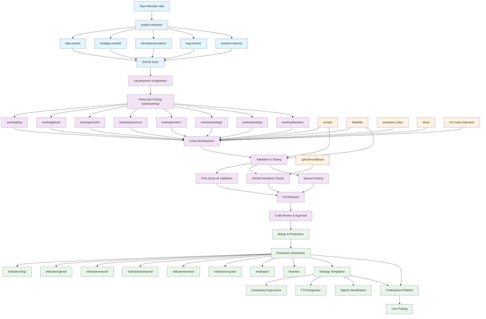
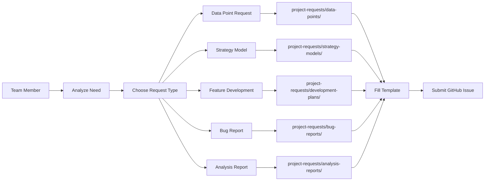
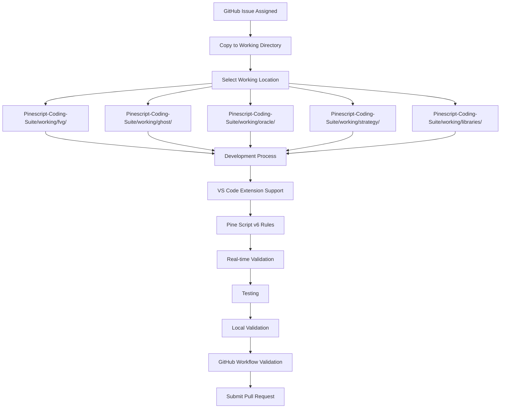
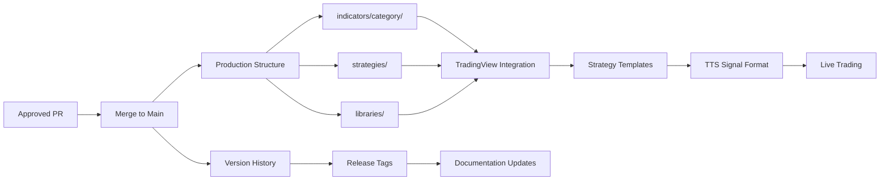
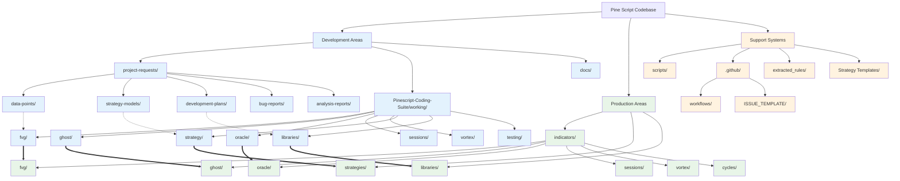
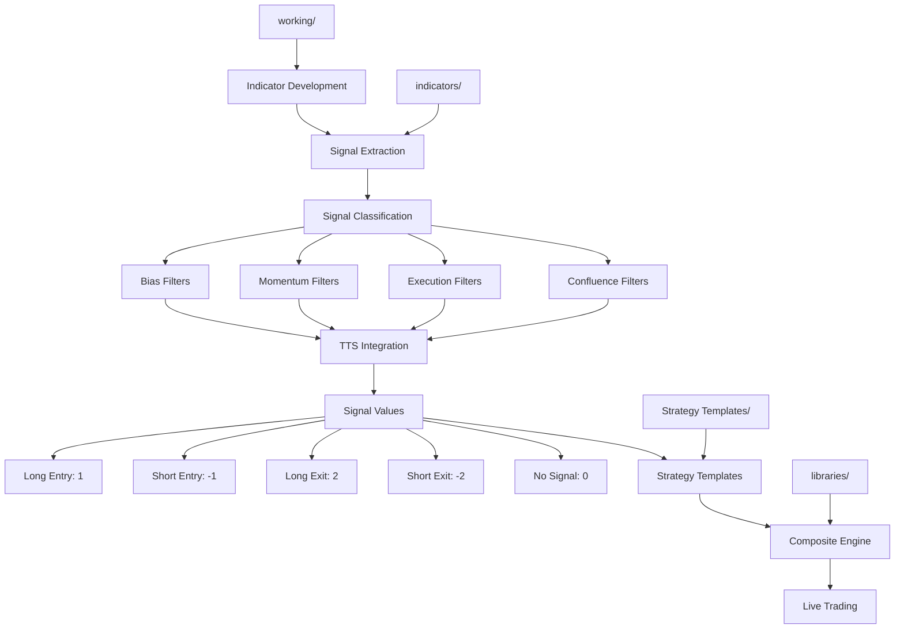
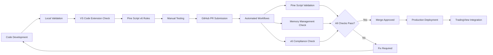

# Pine Script Coding Suite - Complete Workflow Diagram

This diagram shows the complete development workflow for the Pine Script Trading Signals & Strategy Engine.

## 🌊 Development Flow Diagram

## 📋 Workflow Phases Explained

### 🎯 Phase 1: Request & Planning

### 🔧 Phase 2: Development Workflow

### 🚀 Phase 3: Production & Integration

## 🏗️ Directory Structure Flow

## 🎯 Signal Classification & Integration Flow

## 🔄 Quality Assurance Flow

## 📊 Usage Guidelines

### For Team Members:
1. **Start** with `project-requests/` for planning
2. **Develop** in `Pinescript-Coding-Suite/working/`
3. **Test** using validation tools
4. **Submit** PR when ready
5. **Deploy** to production indicators

### For Project Leads:
1. **Review** requests in `project-requests/`
2. **Assign** development tasks
3. **Monitor** progress in working directories
4. **Approve** PRs after validation
5. **Manage** production releases

### For Automation:
- **GitHub Workflows** validate all submissions
- **VS Code Extension** provides real-time feedback
- **Validation Scripts** ensure quality standards
- **Strategy Templates** standardize integration

---

This workflow ensures organized development, quality assurance, and seamless integration from idea to production trading signals.