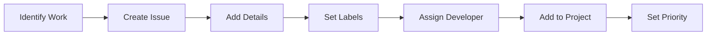

# Pine Script CodeBase - Project Management Guide

## Overview

This guide outlines how we manage the Pine Script CodeBase project using GitHub's built-in project management features. As a project manager, you'll use this system to delegate tasks, track progress, and maintain code quality.

## Project Structure

### 1. GitHub Projects Board

We use a Kanban-style board with the following columns:

- **Backlog**: All unassigned tasks and future work
- **To Do**: Assigned tasks ready to start
- **In Progress**: Active development
- **In Review**: PRs awaiting review
- **Done**: Completed and merged

### 2. Issue Labels

#### Priority Labels:
- `priority-critical`: Must be done ASAP
- `priority-high`: Important, do soon
- `priority-medium`: Normal priority
- `priority-low`: Nice to have

#### Type Labels:
- `indicator`: Indicator development
- `strategy`: Strategy development
- `bug`: Something isn't working
- `enhancement`: Improvement to existing code
- `documentation`: Documentation updates

#### Indicator-Specific Labels:
- `indicator-fvg`: FVG indicator work
- `indicator-ghost`: Ghost indicator work
- `indicator-oracle`: Oracle indicator work
- `indicator-vortex`: Vortex indicator work
- `indicator-cycles`: Cycles indicator work

#### Status Labels:
- `needs-review`: Ready for PM review
- `changes-requested`: Needs updates
- `blocked`: Waiting on something
- `help-wanted`: Developer needs assistance

## Workflow as Project Manager

### 1. Creating Tasks



#### Best Practices:
- Use issue templates for consistency
- Be specific about requirements
- Include examples when possible
- Set realistic deadlines
- Link related issues

### 2. Task Assignment

Consider developer expertise:
- **FVG Expert**: Assign FVG-related tasks
- **Ghost Expert**: Assign Ghost indicator tasks
- **Strategy Expert**: Assign strategy template work
- **Generalist**: Can handle various tasks

### 3. Managing Pull Requests

#### Review Checklist:
- [ ] Code compiles without errors
- [ ] Follows project coding standards
- [ ] Includes necessary documentation
- [ ] Tests pass (manual testing)
- [ ] Version properly incremented
- [ ] No unnecessary files included

#### Review Process:
1. Check automated checks (if any)
2. Review code changes
3. Test functionality in TradingView
4. Provide constructive feedback
5. Approve or request changes

### 4. Communication Guidelines

#### In Issues:
- Clear task descriptions
- Answer questions promptly
- Update status when needed
- Close with summary

#### In PRs:
- Specific feedback on code
- Suggest improvements
- Acknowledge good work
- Clear about required changes

## Team Management

### 1. Onboarding New Developers

1. Add as collaborator with appropriate permissions
2. Share CONTRIBUTING.md
3. Assign a simple first task
4. Provide feedback on first PR
5. Gradually increase complexity

### 2. Permission Levels

- **Read**: Can view and clone
- **Triage**: Can manage issues
- **Write**: Can push to branches (not main)
- **Maintain**: Can manage repo (trusted developers)
- **Admin**: Full access (PM only)

### 3. Performance Tracking

Track metrics like:
- Tasks completed per sprint
- PR turnaround time
- Code quality trends
- Bug introduction rate

## Advanced Features

### 1. Milestones

Create milestones for major releases:
- "v1.0 - Initial Release"
- "v1.1 - Enhanced Signals"
- "v2.0 - Multi-Timeframe Support"

### 2. GitHub Actions (Optional)

Automate workflows:
```yaml
name: Pine Script Validation
on: [pull_request]
jobs:
  validate:
    runs-on: ubuntu-latest
    steps:
      - uses: actions/checkout@v2
      - name: Check Pine Script syntax
        run: ./scripts/pine_master.sh check ${{ github.event.pull_request.head.ref }}
```

### 3. Project Automation

Use GitHub's automation features:
- Auto-move cards when PR created
- Auto-close issues when PR merged
- Auto-assign based on file paths

## Security & Access Control

### 1. Branch Protection Rules

For `main` branch:
- Require PR reviews (1-2 reviewers)
- Dismiss stale reviews
- Require up-to-date branches
- Include administrators

### 2. Secret Management

- Never commit API keys
- Use GitHub Secrets for sensitive data
- Document what secrets are needed

## Reporting & Analytics

### Weekly Reports Should Include:
1. Tasks completed
2. Tasks in progress
3. Blockers identified
4. Team velocity
5. Upcoming priorities

### Monthly Reviews:
1. Code quality trends
2. Feature completion rate
3. Bug discovery/fix rate
4. Team performance
5. Process improvements

## Quick Reference Commands

### For Project Managers:
```bash
# Clone the repository
git clone https://github.com/YOUR_ORG/pinescript-codebase.git

# Check all branches
git branch -a

# Review a PR locally
git fetch origin pull/PR_NUMBER/head:pr-PR_NUMBER
git checkout pr-PR_NUMBER

# Run validation
./scripts/pine_master.sh check path/to/file.pine
```

### GitHub CLI (Optional):
```bash
# List all open PRs
gh pr list

# Review a PR
gh pr review PR_NUMBER

# Create an issue
gh issue create --title "Title" --body "Description"

# Assign an issue
gh issue edit ISSUE_NUMBER --add-assignee USERNAME
```

## Common Scenarios

### Scenario 1: Bug Fix Request
1. Create issue with bug label
2. Assign to developer familiar with that indicator
3. Set priority based on severity
4. Monitor PR for quick turnaround

### Scenario 2: New Feature Development
1. Create detailed issue with requirements
2. Discuss approach in issue comments
3. Assign to appropriate developer
4. Review iteratively if complex

### Scenario 3: Multiple Developers on Same Indicator
1. Break work into separate components
2. Create issues for each component
3. Ensure clear boundaries
4. Coordinate merging order

## Tools & Resources

### Recommended Tools:
- **GitHub Desktop**: Visual Git interface
- **VS Code**: With Pine Script extension
- **TradingView**: For testing
- **GitHub Mobile**: For on-the-go management

### Useful Links:
- [GitHub Projects Documentation](https://docs.github.com/en/issues/planning-and-tracking-with-projects)
- [GitHub Flow Guide](https://guides.github.com/introduction/flow/)
- [Semantic Versioning](https://semver.org/)

## Troubleshooting

### Common Issues:

1. **Merge Conflicts**
   - Have developer rebase on main
   - Or resolve in GitHub UI

2. **Failed Checks**
   - Review error messages
   - Help developer debug
   - Update scripts if needed

3. **Stale PRs**
   - Ping assigned developer
   - Offer assistance
   - Reassign if needed

## Best Practices Summary

1. **Clear Communication**: Always be specific
2. **Timely Reviews**: Don't let PRs sit
3. **Constructive Feedback**: Help developers grow
4. **Document Everything**: Future you will thank you
5. **Automate When Possible**: Save time on repetitive tasks
6. **Trust Your Team**: But verify the work
7. **Celebrate Success**: Acknowledge good work

---

Remember: The goal is to ship quality Pine Script indicators and strategies efficiently while maintaining a positive team environment! 